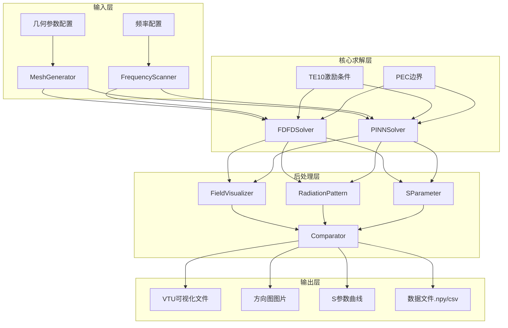

## 用户需求

开发雷达矩形波导辐射槽的电磁仿真系统，使用有限差分频域(FDFD)方法求解Ku波段(12-18GHz)电磁场分布，计算辐射方向图和S参数，并与PINN方法对比验证。

## 产品概述

基于PaddleScience框架构建完整的雷达辐射槽电磁仿真工具链，支持：

- 矩形波导辐射槽几何建模
- FDFD传统方法求解Helmholtz方程
- PINN深度学习方法求解电磁场
- 频段扫描计算S参数
- 辐射方向图计算与可视化
- 两种方法对比验证

## 核心功能

1. **几何建模模块**

- 矩形波导结构定义（宽a=1.02cm，高b=0.51cm）
- 辐射槽位置和尺寸配置
- 二维/三维网格自动生成

2. **FDFD求解器**

- Helmholtz方程离散化（五点/七点差分）
- PEC边界条件实现
- TE10模端口激励条件
- 频段扫描求解（12-18GHz）

3. **PINN求解器**

- 基于项目现有Helmholtz方程和hPINNs架构
- 复杂区域自适应采样
- PML吸收边界处理

4. **后处理与可视化**

- 电磁场2D/3D分布图
- 辐射方向图（极坐标/3D）
- S参数频率响应曲线
- 数据文件导出（.npy/.csv）

5. **对比验证模块**

- FDFD与PINN结果对比
- 相对误差计算
- 收敛性分析

## 技术栈

- **深度学习框架**: PaddlePaddle（项目现有框架）
- **数值计算**: NumPy, SciPy
- **可视化**: Matplotlib, Mayavi/VTK
- **几何处理**: PyMesh（项目内置）
- **配置管理**: Hydra + OmegaConf

## 实现方案

### 整体策略

采用模块化设计，将仿真系统分为几何建模、FDFD求解、PINN求解、后处理四个核心模块。FDFD模块提供传统数值方法的精确基准解，PINN模块基于项目现有hPINNs架构实现快速近似求解，后处理模块统一处理两种方法的结果输出和对比验证。

### 关键技术决策

1. **仿真维度**: 采用2.5D轴对称模型简化计算，对于TE10模只需求解二维Helmholtz方程
2. **网格策略**: FDFD使用均匀网格，PINN使用随机采样+边界采样策略
3. **频率处理**: 使用离散频率点扫描（12-18GHz，步长0.5GHz），避免连续频段计算的内存问题
4. **验证指标**: 使用L2相对误差、最大误差、相关系数作为对比指标

### 性能与可靠性

- **FDFD求解**: 时间复杂度O(N²)，空间复杂度O(N²)，适合精细对比
- **PINN求解**: 训练时间取决于网络规模，推理速度快
- **内存管理**: 分批处理频率点，避免内存溢出
- **数值稳定性**: FDFD使用PML边界，PINN使用Sigmoid激活确保输出稳定

## 实现注意事项

### 代码复用

- 复用 `ppsci/equation/pde/helmholtz.py` 的Helmholtz方程定义
- 参考 `examples/hpinns/` 的hPINNs架构和PML实现
- 参考 `examples/spinn/helmholtz3d.py` 的SPINN求解模式
- 复用 `ppsci/visualize/` 的VTU导出功能

### 性能优化

- FDFD求解使用NumPy向量化操作
- PINN训练使用Adam+LBFGS混合优化策略
- 频段扫描使用并行处理（可选）

### 精度控制

- FDFD网格密度：λ/10（波长的1/10）
- PINN采样密度：与FDFD网格相当的点数
- 频率步长：0.5GHz确保结果平滑

## 架构设计



## 目录结构

```
examples/radiation_slot/
├── __init__.py                      # 包初始化
├── main.py                          # 主入口脚本，支持train/eval/infer模式
├── geometry.py                      # 几何建模模块：矩形波导结构定义和网格生成
├── fdfd_solver.py                   # FDFD求解器：Helmholtz方程离散化、PEC边界、TE10激励
├── pinn_solver.py                   # PINN求解器：复用hPINNs架构，适配辐射槽问题
├── postprocess.py                   # 后处理模块：电磁场可视化、辐射方向图、S参数计算
├── comparator.py                    # 对比验证模块：FDFD与PINN结果对比
├── functions.py                     # 自定义函数：损失函数、指标函数
├── conf/
│   └── radiation_slot.yaml          # Hydra配置文件
├── datasets/                        # 数据集目录（可选）
└── outputs/                         # 输出目录
    ├── fields/                      # 电磁场VTU文件
    ├── radiation_pattern/           # 辐射方向图
    ├── s_parameters/                # S参数曲线
    └── comparison/                  # 对比结果
```

## 关键代码结构

### RadiationSlotGeometry

```python
@dataclass
class RadiationSlotGeometry:
    """矩形波导辐射槽几何参数"""
    waveguide_width: float = 1.02      # 波导宽(cm)，对应TE10截止频率~6GHz
    waveguide_height: float = 0.51     # 波导高(cm)
    slot_length: float = 2.0           # 辐射槽长度(cm)
    slot_position: float = 0.5         # 辐射槽位置
    medium_epsilon: float = 1.0        # 介质介电常数
    medium_mu: float = 1.0             # 介质磁导率
```

### FDFDSolver

```python
class FDFDSolver:
    """FDFD求解器：求解2D Helmholtz方程"""
    def __init__(self, geometry: RadiationSlotGeometry, frequency: float, 
                 mesh_size: float = 0.02):
        self.geometry = geometry
        self.frequency = frequency
        self.mesh_size = mesh_size
        self.wavenumber = 2 * np.pi * frequency * 1e9 * np.sqrt(geometry.medium_epsilon) / 3e8
    
    def solve(self) -> np.ndarray:
        """求解电磁场分布"""
        pass
    
    def apply_pec_boundary(self, field: np.ndarray) -> np.ndarray:
        """应用PEC边界条件"""
        pass
    
    def apply_te10_excitation(self, field: np.ndarray) -> np.ndarray:
        """应用TE10模端口激励"""
        pass
```

### RadiationPatternCalculator

```python
class RadiationPatternCalculator:
    """辐射方向图计算器"""
    def calculate(self, field: np.ndarray, geometry: RadiationSlotGeometry) -> Tuple[np.ndarray, np.ndarray]:
        """计算辐射方向图，返回(角度, 归一化场强)"""
        pass
    
    def calculate_s_parameters(self, field: np.ndarray) -> Tuple[complex, complex]:
        """计算S参数（S11反射系数, S21传输系数）"""
        pass
```