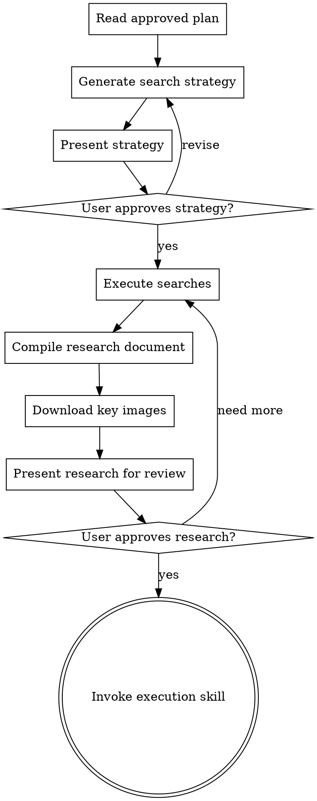

# Research & Gathering

## Overview

Systematically search and organize reference materials after the article plan is approved, before execution begins. This skill ensures every section has adequate supporting evidence and visual assets before writing starts.

**Announce at start:** "I'm using the research-gathering skill to search and organize reference materials for each section."

**Context:** This should follow an approved article plan from the writing-article-plan skill.

**Save research to:** `docs/writing/YYYY-MM-DD-<topic>-research.md`

**Save image assets to:** `docs/writing/assets/YYYY-MM-DD-<topic>/`

<HARD-GATE>
Do NOT execute any searches until you have presented the search strategy for ALL sections and the user has approved it. Do NOT invoke executing-article-plan or any writing skill until the user has reviewed the compiled research document.
</HARD-GATE>

## Checklist

You MUST create a task for each of these items and complete them in order:

1. **Read the approved plan** — load `YYYY-MM-DD-<topic>-plan.md`, extract each section's key points and research needs
2. **Generate search strategy** — produce a search plan per section (keywords, search type, priority)
3. **Present strategy for approval** — user confirms or revises before any search executes
4. **Execute searches** — run web searches and image searches per the approved strategy
5. **Compile research document** — organize results by section, save to `-research.md`
6. **Download key images** — save critical images to local assets directory
7. **Present research for review** — user confirms the materials are sufficient
8. **Transition to execution** — invoke executing-article-plan or subagent-driven-writing

## Process Flow



**The terminal state is invoking the execution skill.** After research is approved, offer the same execution choice as writing-article-plan (batch or subagent-driven).

## Search Strategy Generation

For each section in the plan, analyze and produce a search strategy:

### 1. Extract Research Needs

Read each section's **Key Points**, **Supporting Evidence**, and **Research Needed** fields from the plan.

### 2. Generate Search Keywords

For each section, produce:
- **Primary keywords**: Core terms directly from the section topic
- **Secondary keywords**: Related terms, synonyms, alternative phrasings
- **Image keywords**: Terms specifically for finding visual assets (add "diagram", "architecture", "infographic", etc.)
- **Language**: Generate both Chinese and English keywords when the topic benefits from bilingual sources

### 3. Present Strategy Table

Present the search strategy in this format, then wait for user approval:

```markdown
## Search Strategy

| Section | Search Type | Keywords | Priority |
|---------|-------------|----------|----------|
| 1. [Title] | Web | keyword1, keyword2 | Must Have |
| 1. [Title] | Image | keyword1 diagram, keyword2 architecture | Should Have |
| 2. [Title] | Web | keyword3, keyword4 | Must Have |
| ... | ... | ... | ... |

**Total planned searches:** N web + M image

Shall I proceed with these searches, or would you like to adjust any keywords?
```

**Priority levels:**
- **Must Have** — Critical evidence the section cannot do without
- **Should Have** — Strengthens the argument but section can stand without it
- **Nice to Have** — Additional context or alternative perspectives

## Search Execution

### Web Content Search

1. Use **WebSearch** to find relevant articles, papers, blog posts
2. Use **WebFetch** to retrieve full content from promising results
3. For each result, extract:
   - **Title** and **URL**
   - **Key excerpt** — the most relevant paragraph or data point
   - **Relevance** — how it supports the section's argument
   - **Credibility** — source authority (official docs, peer-reviewed, reputable blog, etc.)

### Image Search

1. Use **WebSearch** with image-oriented keywords
2. For each image result, record:
   - **Description** — what the image shows
   - **Source URL** — original page URL
   - **Image URL** — direct link to the image file
   - **Alt text** — descriptive text for accessibility
   - **License** — usage rights if identifiable
   - **Recommendation** — use as-is, adapt, or create similar

### Selection Criteria

Keep results that meet at least two of:
- **Relevant** — directly supports a key point in the section
- **Authoritative** — from a credible source (official docs, recognized experts, peer-reviewed)
- **Current** — published within the last 2-3 years (for technology topics)

**Per-section limits** to avoid information overload:
- Web results: 3-5 per section
- Image results: 1-3 per section

## Research Document Template

Save compiled results to `docs/writing/YYYY-MM-DD-<topic>-research.md`:

```markdown
# [Topic] - Research Materials

**Date**: YYYY-MM-DD
**Related plan**: `docs/writing/YYYY-MM-DD-<topic>-plan.md`
**Total references**: N web sources, M images

---

## Section 1: [Section Title]

### Web References

#### 1.1 [Article Title](https://source-url.com)
- **Source**: [Site name / Author]
- **Credibility**: [Official docs / Expert blog / Research paper / ...]
- **Key excerpt**:
  > Relevant quote or data point from the source
- **Use in section**: [How this supports the section's argument]

#### 1.2 [Article Title](https://source-url.com)
- **Source**: [Site name / Author]
- **Credibility**: [...]
- **Key excerpt**:
  > ...
- **Use in section**: [...]

### Image References

#### IMG-1.1 [Image description]
- **Source URL**: [page where image was found]
- **Image URL**: [direct link to image]
- **Local path**: `docs/writing/assets/YYYY-MM-DD-<topic>/section-1-description.png` (if downloaded)
- **Alt text**: [Descriptive alt text]
- **License**: [Known license or "Unknown - verify before publication"]
- **Recommendation**: [Use as-is / Adapt / Create similar using draw.io or Excalidraw]

---

## Section 2: [Section Title]

[Same structure repeated...]

---

## Research Summary

| Section | Web Sources | Images | Coverage |
|---------|------------|--------|----------|
| 1. [Title] | 3 | 1 | ✅ Sufficient |
| 2. [Title] | 2 | 0 | ⚠️ Needs image |
| ... | ... | ... | ... |

**Gaps identified:**
- [ ] Section N needs [specific missing material]
- [ ] Image for Section M not found, consider creating with [tool]
```

## Image Asset Management

### Storage Structure

```
docs/writing/assets/YYYY-MM-DD-<topic>/
├── section-1-description.png
├── section-1-description.svg
├── section-3-architecture.png
└── sources.md                    # Image attribution and license info
```

### Download Strategy

- **Download locally**: Images that are critical to the article and at risk of link rot (blog posts, personal sites)
- **URL only**: Images from stable sources (official documentation, Wikipedia, major platforms)
- Always record the source URL regardless of download decision

### Naming Convention

- Format: `section-N-description.{png,jpg,svg}`
- Use lowercase kebab-case
- Keep names descriptive but concise (3-5 words)
- Prefer PNG for screenshots, SVG for diagrams

### License Tracking

Create `sources.md` in the assets directory:

```markdown
# Image Sources & Licenses

| File | Source | License | Attribution |
|------|--------|---------|-------------|
| section-1-overview.png | [URL] | CC BY 4.0 | Author Name |
| section-3-arch.png | [URL] | MIT | Project Name |
```

## Quality Checklist

Before presenting research to the user, verify:

- [ ] Every section in the plan has at least one web reference
- [ ] Must Have priority items are all covered
- [ ] Image references include descriptive alt text
- [ ] Downloaded images are saved with correct naming convention
- [ ] All sources have URLs recorded
- [ ] License information is noted where identifiable
- [ ] Research document follows the template structure
- [ ] Gaps are clearly identified with suggestions for resolution

## Execution Handoff

After the user approves the research document, offer execution choice:

**"Research materials compiled and saved to `docs/writing/YYYY-MM-DD-<topic>-research.md`. Two execution options:**

**1. Subagent-Driven (this session)** - Fresh subagent per section, each subagent receives the section's research materials as context

**2. Batch Execution (focused writing)** - Write sections in batches with checkpoints, referencing research materials throughout

**Which approach?"**

**If Subagent-Driven chosen:**
- **REQUIRED SUB-SKILL:** Use document-superpowers:subagent-driven-writing
- Pass research file path as context for each subagent

**If Batch Execution chosen:**
- **REQUIRED SUB-SKILL:** Use document-superpowers:executing-article-plan
- Reference research file at the start of execution

## Key Principles

- **Search before you write** — Every section deserves supporting evidence
- **User controls the strategy** — Never search without strategy approval
- **Quality over quantity** — 3 great sources beat 10 mediocre ones
- **Organize by section** — Writers should find what they need instantly
- **Track images carefully** — URLs break; download what matters, record everything
- **Identify gaps early** — Better to know what's missing before writing starts
