# Tech Doc Mermaid

## Overview

Enhancement plugin that generates Mermaid diagrams during the execution stage of technical document writing. Diagrams visualize architectures, flows, relationships, and processes that are difficult to explain with text alone.

**Invoked by:** `tech-doc-writing` during execution stage, or manually when a section needs visual explanation.

**Trigger signals:**
- Section describes system architecture or component relationships
- Section explains a multi-step process or workflow
- Section covers request/response flows between services
- Section documents data models or state transitions
- Text says "as shown in the diagram" or similar

## When to Use Diagrams

**Use a diagram when:**
- The concept involves 3+ interacting components
- A process has branching logic or multiple paths
- The relationship between entities needs visual clarity
- Text alone would require 200+ words to describe what a diagram shows in seconds

**Skip a diagram when:**
- The concept is linear and simple (use a numbered list instead)
- A table would communicate the information better (e.g., feature comparisons)
- The diagram would have fewer than 3 nodes (too trivial)
- The diagram would have more than 15-20 nodes (too complex — split into multiple diagrams)

## Diagram Type Selection Guide

| Content You're Documenting | Recommended Diagram | Mermaid Type |
|---|---|---|
| System architecture / component layout | Architecture diagram | `flowchart` or `graph` |
| Request flow between services | Sequence diagram | `sequenceDiagram` |
| Object lifecycle / status transitions | State diagram | `stateDiagram-v2` |
| Database schema / entity relationships | ER diagram | `erDiagram` |
| CI/CD pipeline / deployment flow | Flow diagram with subgraphs | `flowchart` |
| Decision logic / troubleshooting tree | Flowchart with diamonds | `flowchart` |
| Class hierarchy / interface relationships | Class diagram | `classDiagram` |
| Project timeline / release roadmap | Timeline | `timeline` |
| Git branching strategy | Git graph | `gitGraph` |
| User journey / experience flow | User journey | `journey` |

## Document Type to Diagram Mapping

Each document type benefits from specific diagram types:

| Document Type | Primary Diagram | Secondary Diagram |
|---|---|---|
| Tutorial / How-To | Step flowchart | — |
| Architecture | Component flowchart | Sequence diagram |
| API Reference | Sequence diagram | ER diagram |
| Troubleshooting | Decision flowchart | — |
| Concept Explainer | Flowchart / State diagram | — |
| Comparison | — (use tables instead) | — |
| Best Practice | — (use code examples instead) | — |
| Release Note | Timeline | — |

## Mermaid Syntax Best Practices

### Mandatory Rules

1. **Node IDs: camelCase, no spaces**

Good:
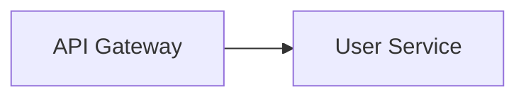

Bad:
```
flowchart LR
    API Gateway --> User Service
```

2. **Special characters in labels: use double quotes**

Good:
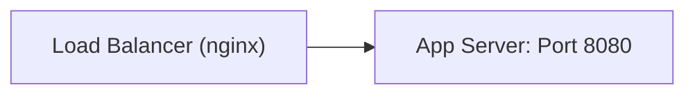

3. **Avoid reserved words as node IDs**

Reserved: `end`, `subgraph`, `graph`, `flowchart`, `style`, `class`, `click`

Good:
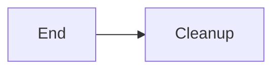

4. **Subgraphs: use `subgraph id [Label]` format**

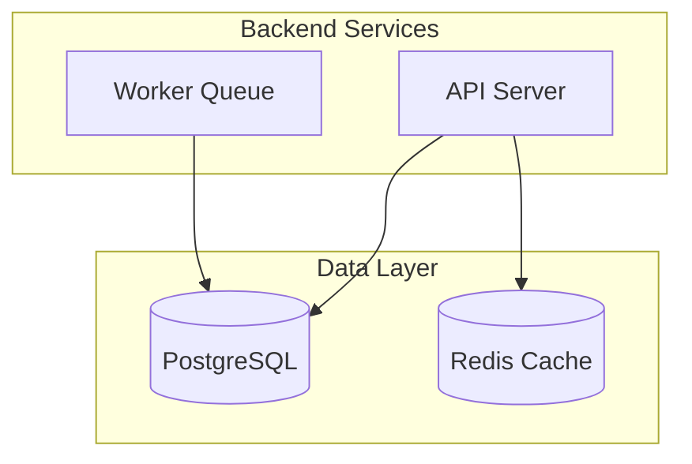

5. **No inline styling** — Let the rendering theme handle colors

Bad:
```
style apiServer fill:#f9f,stroke:#333
```

6. **Edge labels with special characters: wrap in quotes**

Good:
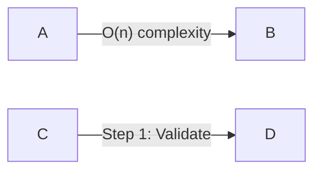

## Diagram Templates

### Architecture Diagram

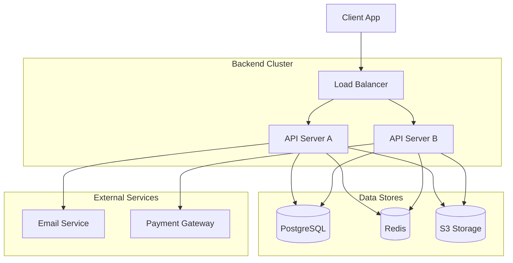

### Sequence Diagram (API Request Flow)

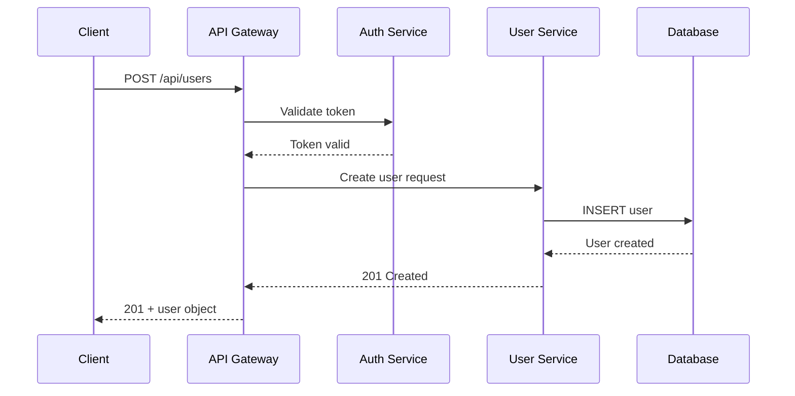

### State Diagram (Object Lifecycle)

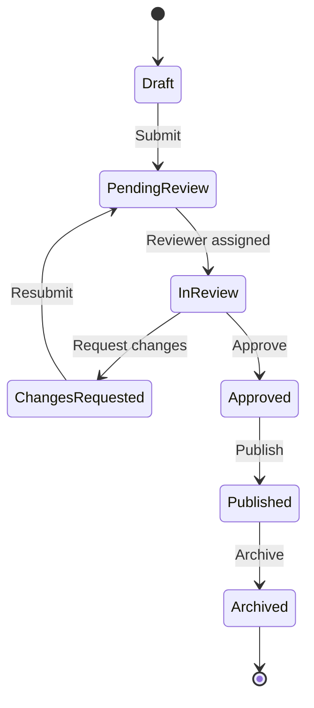

### ER Diagram (Data Model)

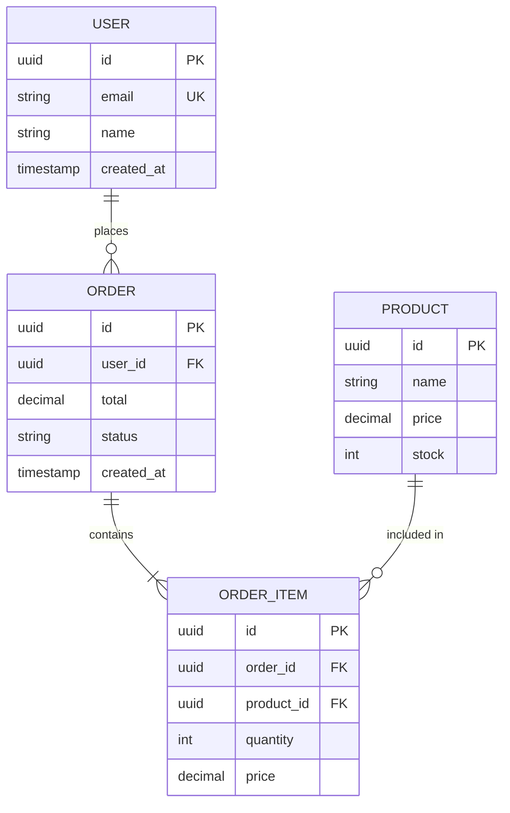

### Decision Flowchart (Troubleshooting)

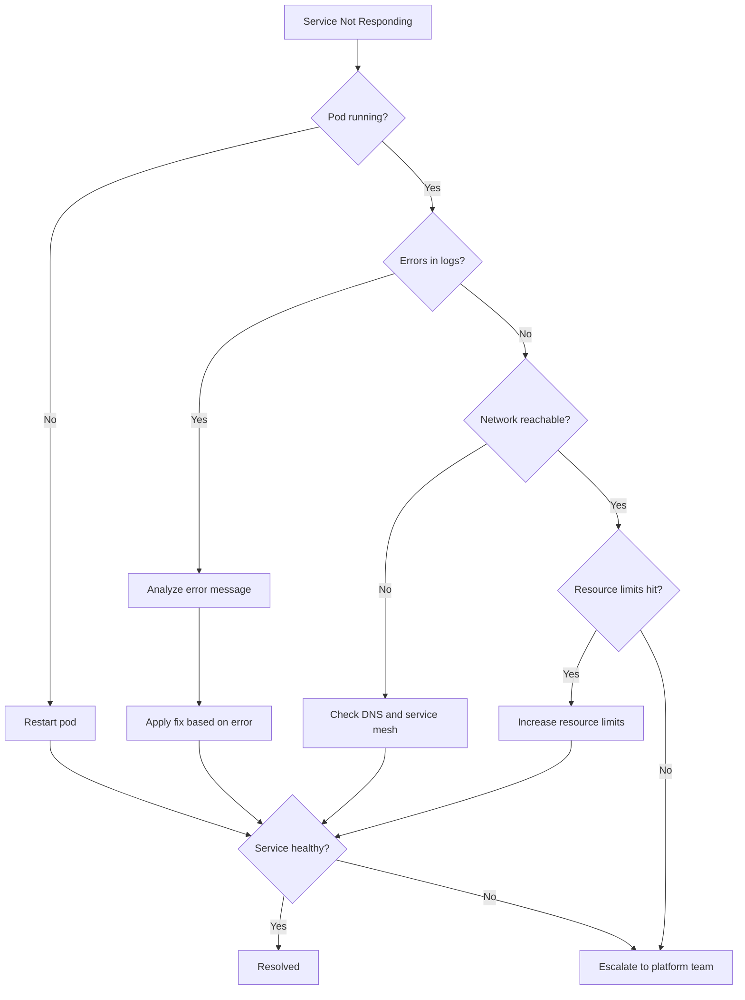

### CI/CD Pipeline

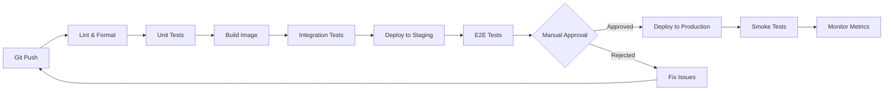

### Timeline (Release Roadmap)

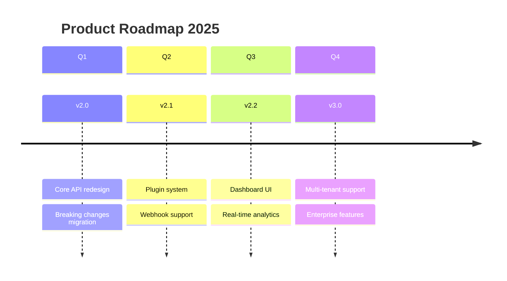

### Git Graph (Branching Strategy)

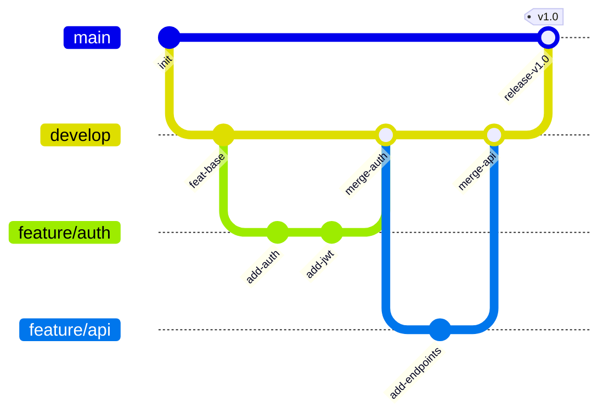

## Diagram Placement Guidelines

- Place the diagram **immediately after** the text that introduces it
- Add a brief caption below the diagram explaining what it shows
- Reference the diagram in surrounding text: "As shown in the diagram below..."
- If a diagram is referenced from multiple sections, place it in the first reference and use text references from later sections

**Example placement:**

```markdown
The system follows a standard three-tier architecture. The API gateway
handles authentication before forwarding requests to the backend cluster.

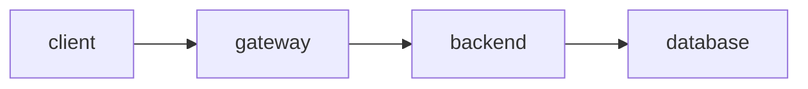

*Figure 1: High-level request flow from client to database.*

Each component in this architecture runs as a separate Kubernetes deployment...
```

## Complexity Guidelines

| Diagram Size | Nodes | Recommended Action |
|---|---|---|
| Simple | 3-6 | Single diagram, inline |
| Medium | 7-12 | Single diagram with subgraphs |
| Complex | 13-20 | Consider splitting into 2 focused diagrams |
| Too complex | 20+ | Must split — overview diagram + detail diagrams |

## Quality Checklist

Before finalizing a section with Mermaid diagrams, verify:

- [ ] Diagram renders without syntax errors
- [ ] Node IDs use camelCase (no spaces)
- [ ] Labels with special characters are quoted
- [ ] No reserved words used as node IDs
- [ ] No inline styling or color definitions
- [ ] Diagram has 3-15 nodes (not too simple, not too complex)
- [ ] Labels are concise (2-4 words per node)
- [ ] Diagram accurately represents the described system
- [ ] A brief caption or description accompanies the diagram
- [ ] Diagram type matches the content (not forcing a flowchart when a sequence diagram fits better)

## Key Principles

- **Diagram complements text** — It should clarify, not duplicate what the text says
- **Right diagram for the job** — Use the selection guide; don't default to flowcharts for everything
- **Simplicity wins** — If you need more than 15 nodes, split into multiple diagrams
- **No styling** — Let the theme handle colors; diagrams should work in light and dark mode
- **Accurate over pretty** — The diagram must correctly represent the system
- **Caption everything** — A diagram without context is a puzzle
