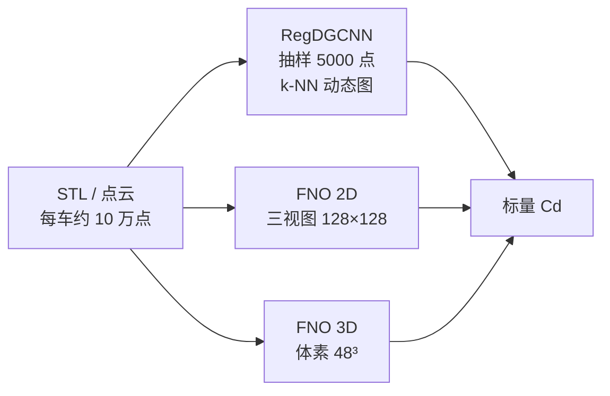

# 学习文档：流体代理模型从 0 到 1（DrivAerNet）

| 项目 | 说明 |
|------|------|
| 适用对象 | 第一次用神经网络替代 CFD 的同学；会一点 Python，不必先会网格生成 |
| 预计学时 | 阅读 1.5～2 小时；冒烟实验 10～30 分钟；全量训练另计（图网络可达数小时） |
| 配套代码 | [`examples/drivaernet/`](https://github.com/PaddlePaddle/PaddleScience/tree/develop/examples/drivaernet) |
| 论文复现 | [DrivAerNet 案例页](../examples/drivaernet.md) |

学完应能独立做到：说清代理模型在学什么、准备好 DrivAerNet 数据、跑通训练与评估、解释每一项 YAML、用四个指标判断模型能不能进设计流程。

---

## 学习路线

```text
第 1 课 原理：Cd、CFD / PINN / 代理模型
第 2 课 数据：点云、CSV、划分
第 3 课 模型：RegDGCNN、FNO2d、FNO3d
第 4 课 动手：训练、评估、TensorBoard
第 5 课 评价：MSE / MAE / MaxAE / R² 与及格线
第 6 课 参数：三份 YAML 逐项
第 7 课 边界：能做什么、不能做什么
结业   对照清单 + 术语表
```

建议顺序：先读第 1～3 课（不需要 GPU），再做第 4 课冒烟，对照第 5 课读日志，需要改配置时查第 6 课。

---

## 课前准备

- 已按 [安装使用](../install_setup.md) 装好 Paddle 与 PaddleScience，最好有一块 GPU。
- 工作目录在仓库根目录 `/data/PaddleScience`（或你的克隆路径）。
- 磁盘预留数 GB：点云数据包 + 检查点。
- 可选：`tensorboard` / `tensorboardX`，三条路径默认会写事件文件。

自检：

```bash
python -c "import paddle, ppsci; print(paddle.__version__, ppsci.__version__)"
```

---

## 第 1 课　原理：代理模型在近似什么

### 1.1 要解决的工程问题

汽车外形一改，空气阻力就变。传统做法是对每个外形跑 CFD：画网格、解 Navier–Stokes、等收敛，单车常常要数小时。设计阶段要扫成百上千个外形时，这个成本扛不住。

**流体代理模型（surrogate / proxy）** 用已经算过的「外形 → 阻力」样本做监督学习；新外形进来后，几秒给出预测，不再解 PDE。

DrivAerNet 里映射是：

$$
G:\ \text{车身几何}\ \mapsto\ C_d
$$

损失函数里**没有 PDE 残差**。物理信息全部来自 CFD 标签。这是数据驱动代理，不是 PINN。

```text
已经算过的「外形 → 阻力」样本
        ↓ 监督学习
神经网络学会这个映射
        ↓ 新外形进来
几秒给出阻力预测（不再解 PDE）
```

### 1.2 阻力系数 \(C_d\)

气流以速度 \(u_\infty\) 吹过汽车，车身受到沿来流方向的力 \(F_d\)。无量纲化后：

$$
C_d = \frac{F_d}{\tfrac{1}{2}\rho u_\infty^2 A_{\mathrm{ref}}}
$$

| 符号 | 含义 | 为什么要无量纲 |
|------|------|----------------|
| \(F_d\) | 阻力（牛顿） | 随车速平方、空气密度、迎风面积一起变 |
| \(\rho\) | 空气密度 | 高原和海平面不同 |
| \(u_\infty\) | 来流速度 | DrivAerNet 取 \(30\,\mathrm{m/s}\) |
| \(A_{\mathrm{ref}}\) | 参考迎风面积 | 大车和小车要能比较 |

本仓库 CSV 里 `Average Cd` 大约 **0.25～0.38**，均值约 **0.311**，标准差约 **0.026**。工程上把 \(0.001\) 叫 **1 个 drag count**。改后视镜、扩散器往往只动几个 count；代理模型若平均误差到 \(0.02\)（20 counts），排序设计时就会把好坏车搞反。

### 1.3 三种「算阻力」不要混

| 方法 | 输入 | 训练时有没有物理方程 | 一次新外形的代价 | 典型用途 |
|------|------|----------------------|------------------|----------|
| **CFD** | 网格 + 边界条件 | 直接离散求解 NS | 小时～天 | 标签来源、最终确认 |
| **PINN** | 坐标点 | 损失里加 PDE 残差 | 中等 | 方程已知、数据少 |
| **本案例的代理模型** | 几何（点云或占有格） | **没有** PDE，只拟合 CFD 标签 | 秒级 | 设计空间扫描、粗排 |

DrivAerNet 的物理「藏」在标签里：每辆车都用 OpenFOAM 的 SIMPLE + \(k\)-\(\omega\) SST、雷诺数约 \(9.39\times 10^6\) 算过。网络只负责记住「这种外形对应那种 \(C_d\)」。换一套来流或湍流模型，标签分布会变，网络必须重训或微调。

### 1.4 训练在最小化什么

$$
\mathcal{L} = \frac{1}{N}\sum_{i=1}^{N}\big(\hat{C}_{d,i}-C_{d,i}\big)^2
$$

\(C_{d,i}\) 来自 CSV 的 `Average Cd`。代码里是 `SupervisedConstraint` + `MSELoss("mean")`。没有边界条件损失，没有方程残差。

### 1.5 几何必须变成张量

神经网络只能吃固定形状的数组。三维车身是曲面，所以要先编码。本案例三条路解决同一件事：

| 配置 | 模型 | 几何怎么表示 | 适合直觉 |
|------|------|----------------|----------|
| `conf/drivaernet.yaml` | **RegDGCNN**（论文原模型） | 不规则点云 `vertices` | 直接摸车身表面的点 |
| `conf/drivaernet_fno.yaml` | **FNOCdNet** + TFNO2d | 三视图占有格 `occupancy` | 俯视 / 侧视 / 前视三张密度图 |
| `conf/drivaernet_fno3d.yaml` | **FNOCdNet** + TFNO3d | 三维体素占有格 | 把车装进 \(48^3\) 的盒子 |



官方 RegDGCNN 预训练权重测试集 \(R^2 \approx 88.22\%\)。推理约秒级；同规模 CFD 往往数小时。

**学完检查**

1. 本案例损失里有没有 PDE 残差？物理从哪来？
2. \(C_d=0.31\) 和 MAE \(=0.01\) 大概相当于多少个 drag count？
3. 为什么换来流速度后，旧权重可能不准？

---

## 第 2 课　案例数据

### 2.1 车从哪来

基准外形是慕尼黑工大的 **DrivAer 快背**，带详细底盘、车轮和后视镜（FDwWwM）。论文用 ANSA 做了 **50 个几何参数、32 个可变形体**，最优拉丁超立方采样约 **4000** 个外形。本仓库过滤后 CSV 有 **3966** 行。

必须带轮子和底盘：文献里拿掉这些细节后，\(C_d\) 会从约 0.12 被严重低估；加上轮、镜、底盘，阻力可以增大一倍以上。代理模型如果只见过「光滑肥皂车」，上真车会失效。

### 2.2 本案例实际用到的文件

完整 DrivAerNet 含三维速度、压力、壁面剪应力，体积可达 TB。这个例子**只做阻力标量回归**，因此只需要：

| 文件/目录 | 作用 | 规模 |
|-----------|------|------|
| `DrivAerNetPlusPlus_Processed_Point_Clouds_100k_paddle/*.paddle_tensor` | 每车一个点云（约 10 万表面点，xyz） | 一车一个文件 |
| `AeroCoefficients_DrivAerNet_FilteredCorrected.csv` | 设计 ID 与气动系数 | 3966 行 |
| `subset_dir/train_design_ids.txt` | 训练集 ID | **2772** |
| `subset_dir/val_design_ids.txt` | 验证集 ID | **595** |
| `subset_dir/test_design_ids.txt` | 测试集 ID | **594** |

划分约 **70% / 15% / 15%**。CSV 列：

| 列名 | 含义 | 本案例用不用 |
|------|------|----------------|
| `Design` | 例如 `DrivAer_F_D_WM_WW_0001` | 对齐点云文件名 |
| `Average Cd` | 时均阻力系数 | **回归标签** |
| `Average Cl` | 升力系数 | 不用 |
| `Average Cl_f` / `Average Cl_r` | 前轴 / 后轴升力 | 不用 |

### 2.3 动手：准备数据

在仓库根目录：

```bash
mkdir -p examples/drivaernet/data
cd examples/drivaernet/data
wget -c https://dataset.bj.bcebos.com/PaddleScience/DNNFluid-Car/DrivAer%2B%2B/data.tar
tar -xvf data.tar
```

解压后应看到上面三样。若只放了 `data.tar` 还没解压，**FNO 脚本会自动下载/解压**；RegDGCNN 默认按 YAML 里的 `ARGS.*` 相对路径读同一套 `data/`。

### 2.4 点云进网络之前发生了什么

`DrivAerNetDataset`（`ppsci/data/dataset/drivaernet_dataset.py`）对每辆车：

1. 用 `Design` 打开 `{id}.paddle_tensor`。
2. 随机抽到固定点数 `num_points`（太多就下采样，太少就零填充）。
3. **仅训练且未关闭增强时**：随机缩放+平移，再加截断高斯抖动，避免死记绝对坐标。
4. 标签取 `Average Cd`，样本权重恒为 1。

FNO 路径再包一层 `DrivAerNetOccupancyDataset`：**关闭**上述增强（否则绝对尺寸被弄乱），把点投到占有格，并单独给出相对尺寸 `geom_size`。

**学完检查**

1. 训练调参应该看 `val` 还是 `test`？最终报数看哪个？
2. 为什么 FNO 要关掉点云增强？
3. 本案例用不用升力 `Cl`？

---

## 第 3 课　三条模型路径

### 3.1 RegDGCNN：点云上的动态图

论文把分类用的 DGCNN 改成回归。默认输入 \(N=5000\) 个点、坐标 \((x,y,z)\)，输出一个标量 \(C_d\)。

点云没有像素网格，所以每一层都在**当前特征空间**里找 k 近邻（默认 \(k=40\)），对边做 **EdgeConv**：

$$
h_{ij}=\mathrm{MLP}\big([x_i,\; x_j-x_i]\big),\qquad
x_i'=\max_{j\in\mathcal{N}(i)} h_{ij}
$$

相对坐标 \(x_j-x_i\) 编码局部形状（棱线、后视镜根部、尾缘）；图在**每层之后重建**，所以叫动态图。

```text
点云 (B, N, 3)
  → 转成 (B, 3, N)
  → 四层 EdgeConv（通道 256 → 512 → 512 → 1024），每层邻域 max 池化
  → 四层特征拼接 (2304) → 1D 卷积到 emb_dims=512
  → 全局 max 池化 ⊕ 全局 avg 池化 → 1024 维
  → MLP 128→64→32→16→1，中间 Dropout
  → Cd
```

约 300 万参数。对点的顺序近似不变。k-NN 显存大，所以 `batch_size=1`。实现：`ppsci/arch/regdgcnn.py`。

### 3.2 TFNO2d：三视图占有格

不规则点云不能直接 FFT。每辆车先缩到自己的单位立方体，再投进三张二维密度图（俯视 \(x\)–\(y\)、侧视 \(x\)–\(z\)、前视 \(y\)–\(z\)），得到 `[3, H, W]`。默认 \(128\times 128\)，大约 4 cm/像素。绝对长宽高变成 3 维 `geom_size`（相对训练集全局包围盒），拼进回归头——否则「大车小车缩成同一格」会丢掉尺度。

占有格还做了 `log1p`、\(3\times 3\) 盒滤波、除以峰值，减轻稀疏格子的椒盐噪声。

```text
点云 (N, 3)
  → 单车对齐三视图 (3, 128, 128) + 相对尺寸 (3,)
  → TFNO2d：lifting → 4 层 Fourier（每轴 32 个模态，GroupNorm）→ projection
  → 空间 mean ⊕ max 池化 ⊕ 尺寸
  → MLP 预测「相对训练集 Cd 均值的残差」，再加上该均值
```

残差头让网络一开始就接近「猜平均值」。`cd_std` 只写入 buffer，前向里不用。实现：`examples/drivaernet/fno_model.py`。

### 3.3 TFNO3d：体素占有格

三视图会把底盘通道、轮腔叠成一层密度。3D 路径把点投到 \(48^3\) 体素（约 11 cm），轴序 \((z,y,x)\)，通道数为 1。读出头与 2D 相同。

T4 量级 GPU 上默认 `batch_size=4`、hidden 24、每轴 12 个模态。格子再加密，显存按边长三次方涨。

**学完检查**

1. EdgeConv 的「动态」指什么？
2. FNO 为什么要单独喂 `geom_size`？
3. 什么时候选 3D 而不选三视图？

---

## 第 4 课　训练与推理（动手）

入口永远是 `examples/drivaernet/drivaernet.py`。Hydra 用 `--config-name` 选 YAML，`mode` 选 `train` 或 `eval`。

### 4.1 代码在干什么

1. `ensure_drivaernet_data`：检查点云、CSV、划分，缺则下包解压。
2. 建模型：`RegDGCNN` 或 `build_fno_model`。
3. 训练集 → `SupervisedConstraint`（监督损失）。
4. 验证集 → `SupervisedValidator`（MSE / MAE / MaxAE / \(R^2\)）。
5. 优化器：Adam；RegDGCNN 用 `ReduceOnPlateau`，FNO 用 Cosine。
6. `ppsci.solver.Solver`：前向 → 反传 → 按 `eval_freq` 验证 → 存 `best_model.pdparams`。
7. FNO 结束时在 `visual/` 写出占有格预览和 Cd 散点图。

RegDGCNN 还开了 AMP（`use_amp=True`, `amp_level="O1"`），减轻图卷积显存。

没有单独的部署脚本：**`mode=eval` 就是推理**。评估用从未参与训练的 test 划分，且 `eval_with_no_grad: true`。

### 4.2 实验 A：冒烟（必做）

目标：确认「数据能读、一个 epoch 能跑、指标能打印」。数字不会好。

```bash
# 在仓库根目录
python examples/drivaernet/drivaernet.py \
  TRAIN.epochs=1 TRAIN.train_fractions=0.02 TRAIN.num_workers=2
```

或 FNO（更快看到图）：

```bash
python examples/drivaernet/drivaernet.py --config-name drivaernet_fno \
  TRAIN.epochs=2 TRAIN.batch_size=2 MODEL.grid_size=32 TRAIN.num_workers=2
```

通过标准：日志里出现训练 loss，没有立刻 `FileNotFoundError`；FNO 结束时 `output_dir/visual/` 下有图。

### 4.3 实验 B：全量训练（选做）

```bash
python examples/drivaernet/drivaernet.py                          # RegDGCNN，100 epoch
python examples/drivaernet/drivaernet.py --config-name drivaernet_fno
python examples/drivaernet/drivaernet.py --config-name drivaernet_fno3d
```

Hydra 覆盖不必改文件：

```bash
python examples/drivaernet/drivaernet.py TRAIN.epochs=20 TRAIN.num_points=2048 MODEL.k=20
```

TensorBoard（三条路径默认 `use_tbd=true`）：

```bash
tensorboard --logdir ./outputs_drivaernet --port 6006
tensorboard --logdir ./outputs_drivaernet_fno --port 6007
tensorboard --logdir ./outputs_drivaernet_fno3d --port 6008
```

| 标签 | 含义 |
|------|------|
| `train/loss` | 训练 MSE |
| `train/lr`、`train/ips` | 学习率、吞吐 |
| `eval/DrivAerNet_eval/*` | 验证 MSE / MAE / \(R^2\) 等 |
| `eval/best_metric` | 迄今最优验证指标 |
| `pred/cd_scatter` | 真值 vs 预测 Cd |
| `pred/occupancy_views` | 占有格预览（仅 FNO） |

### 4.4 实验 C：评估 / 推理

```bash
# 官方预训练（RegDGCNN 默认已填 URL）
python examples/drivaernet/drivaernet.py mode=eval

# 自己的检查点
python examples/drivaernet/drivaernet.py mode=eval \
  EVAL.pretrained_model_path=outputs_drivaernet/<run>/checkpoints/best_model.pdparams

python examples/drivaernet/drivaernet.py --config-name drivaernet_fno mode=eval \
  EVAL.pretrained_model_path=outputs_drivaernet_fno/<run>/checkpoints/best_model.pdparams
```

真正「新车」推理时，必须与训练相同的点数 / 占有格流程；FNO 还要同一套全局 bbox 与 `cd_mean`。

**学完检查**

1. `mode=eval` 默认读的是 train、val 还是 test？
2. 训练中验证应该用哪个 ID 文件？为什么不要用 test？
3. FNO 评估时漏了 `bbox` 缓存会怎样？

---

## 第 5 课　评价标准

验证 / 测试时四个指标一起看，不要只盯 loss。实现见 `ppsci/metric/`。

设 \(y_i\) 为 CFD 真值，\(\hat{y}_i\) 为预测，\(\bar{y}\) 为真值均值。

| 指标 | 公式直觉 | 怎么读 |
|------|----------|--------|
| **MSE** | \(\frac{1}{N}\sum(y_i-\hat{y}_i)^2\) | 与训练损失同形；对大误差更敏感。MSE \(=10^{-4}\) 大约 RMSE \(=0.01\)（10 counts） |
| **MAE** | \(\frac{1}{N}\sum\|y_i-\hat{y}_i\|\) | 直接换成 drag count。MAE \(=0.008\) = 平均偏 8 counts。飞桨全量复现相对误差约 **7.48%** |
| **Max AE** | \(\max_i\|y_i-\hat{y}_i\|\) | 最差那一辆。平均值好看但有一辆偏 30 counts，可能把「假最优」送进风洞 |
| **\(R^2\)** | \(1-\sum(y-\hat{y})^2/\sum(y-\bar{y})^2\) | 0 = 盲猜均值；1 = 完美；负数 = 比盲猜还差。官方预训练 **88.22%**，论文约 **0.9** |

本数据集 \(C_d\) 标准差只有约 0.026，方差本来就小，所以 \(R^2\) 对系统偏差很敏感。

### 及格线（仅针对本任务的标量 \(C_d\)）

| 档位 | \(R^2\) | MAE（约） | MaxAE（约） | 能做什么 | 不能做什么 |
|------|---------|-----------|-------------|----------|------------|
| 基线 | \(<0.5\) | \(>0.02\) | 很大 | 流水线通了 | 不能用来选车 |
| 可用排序 | \(0.7\sim 0.85\) | \(0.01\sim 0.015\) | \(<0.04\) | 从 1000 辆里筛出较好的一批 | 不能当最终 \(C_d\) 报价 |
| 接近论文 | \(\geq 0.85\) | \(\lesssim 0.01\) | 关注是否个别翻车 | 设计空间粗探、与优化器耦合 | 仍需对 Top 候选补 CFD / 风洞 |

定性检查：

1. **散点应贴 45° 线**。整体平移 = 偏差；喇叭口 = 某一端更不准。
2. **训练 MSE 降、验证 \(R^2\) 不涨** = 过拟合。可减 `train_fractions`、加大 `weight_decay` 或保持 Dropout。
3. **验证好、测试差** = 划分泄漏或增强过猛。

**学完检查**

1. 为什么不能只看 MSE？
2. \(R^2=0\) 的模型在干什么？
3. 你的测试集数字属于上表哪一档？能进设计流程的哪一步？

---

## 第 6 课　每个参数

Hydra 先合并 `ppsci_default`，再被案例 YAML 覆盖。命令行 `KEY=value` 优先级最高。路径相对**当前工作目录**或**案例目录**均可。

### 6.1 三条配置共用

| 参数 | 默认（RegDGCNN / FNO2d / FNO3d） | 含义 | 改它的后果 |
|------|----------------------------------|------|------------|
| `mode` | `train` | `train` 训练，`eval` 评估 | 评估必须给检查点（RegDGCNN 默认已填官方权重） |
| `seed` | `1` | 随机种子 | 点采样、增强、初始化都依赖它；对比实验请固定 |
| `device` | 仅 FNO 写了 `gpu` | 运行设备 | CPU 能跑但极慢 |
| `output_dir` | Hydra 运行目录 | 日志、检查点、可视化 | 默认 `outputs_drivaernet[_fno[_3d]]/<日期>/<时间>/` |
| `log_freq` | `100` / `20` / `20` | 每隔多少 **iteration** 打日志 | 太小会刷屏、拖慢 I/O |
| `use_tbd` | `true` | 是否写 TensorBoardX | 关掉：`use_tbd=false` |
| `hydra.run.dir` | 见各文件 | 本次实验目录模板 | `chdir: false` 表示不切换 cwd |
| `hydra.job.name` | `${mode}` | 任务名 | 一般不用改 |
| `ARGS.dataset_path` | 点云目录 | `.paddle_tensor` 所在处 | 路径错了会触发自动下包或报错 |
| `ARGS.aero_coeff` | CSV 路径 | Cd 标签表 | 列名必须有 `Design` 和 `Average Cd` |
| `ARGS.subset_dir` | 划分目录 | 三个 `*_design_ids.txt` | 决定谁是 train/val/test |
| `ARGS.data_url` | 仅 FNO YAML 显式给出 | 数据包 URL | 本地已有数据可忽略 |

### 6.2 `MODEL`：RegDGCNN（`drivaernet.yaml`）

| 参数 | 默认 | 含义 | 怎么选 |
|------|------|------|--------|
| `input_keys` | `["vertices"]` | 点云键名 | 必须与数据集一致 |
| `output_keys` | `["cd_value"]` | 输出 / 标签键 | 必须与 label 键一致 |
| `weight_keys` | `["weight_keys"]` | 样本权重键 | 当前恒为 1 |
| `k` | `40` | 每层 k-NN 邻居数 | 更大：感受野↑、显存↑；太小：局部几何糊 |
| `emb_dims` | `512` | 全局嵌入维数 | `linear1` 输入是 `emb_dims*2`（max⊕avg） |
| `dropout` | `0.4` | MLP 头 Dropout | 过拟合保持或略增；欠拟合可降到 0.2 |
| `output_channels` | `1` | 回归输出维 | 只预测 Cd 时必须为 1 |

### 6.3 `MODEL`：FNO 2D / 3D

| 参数 | 2D 默认 | 3D 默认 | 含义 | 怎么选 |
|------|---------|---------|------|--------|
| `arch` | `FNO` | `TFNO3D` | 选 2D 还是 3D 骨干 | 脚本用它判断走 `train_fno` |
| `input_keys` | `["occupancy"]` | 同左 | 占有格键名 | 数据集输出必须同名 |
| `output_keys` | `["cd_value"]` | 同左 | Cd 输出键 | |
| `weight_keys` | `["weight_keys"]` | 同左 | 样本权重 | 恒为 1 |
| `occupancy_layout` | （缺省 `views`） | `voxels` | 三视图 / 体素 | 与 `arch` 必须匹配 |
| `grid_size` | `128` | `48` | 每轴格子数 | 2D 显存 \(\propto H\cdot W\)；3D \(\propto D^3\)。试跑可设 32 |
| `n_modes_height` | `32` | `12` | 高度方向傅里叶模态 | 太小丢细节，太大近乎稠密卷积 |
| `n_modes_width` | `32` | `12` | 宽度方向模态 | 通常与 height 相同 |
| `n_modes_depth` | 无 | `12` | 深度方向模态 | **3D 必填** |
| `in_channels` | `3` | `1` | 占有格通道 | 三视图 3，体素 1 |
| `hidden_channels` | `32` | `24` | FNO 隐层宽度 | 容量与显存的主旋钮 |
| `field_channels` | `32` | `24` | 骨干输出通道，随后被池化 | 与 hidden 接近即可 |
| `lifting_channels` | `64` | `48` | 升维 MLP 宽 | 略大于 hidden 较常见 |
| `projection_channels` | `64` | `48` | 投到 `field_channels` 的宽 | |
| `n_layers` | `4` | `4` | Fourier 层数 | 4 是常用深度 |
| `head_hidden` | `128` | `128` | Cd 回归头隐层宽 | 标量回归，128 足够 |
| `use_size_features` | `true` | `true` | 是否把相对长宽高拼进头 | 关掉通常变差 |
| `norm` | `group_norm` | `group_norm` | FNO 块归一化 | 小 batch 时比 BatchNorm 稳 |
| `factorization` | （默认 `dense`） | `dense` | 谱权重是否低秩分解 | `dense` 最准也最占参数 |

运行时自动写入（不必手填）：

| 运行时量 | 来源 | 作用 |
|----------|------|------|
| `MODEL.bbox_min` / `bbox_span` | 训练集点云全局包围盒，缓存 `data/fno_global_bbox.npz` | 给 `geom_size` 当除数；评估必须用**同一**盒子 |
| `cd_mean` / `cd_std` | 训练集 `Average Cd` | 残差头加回均值；std 仅兼容检查点 |

### 6.4 `TRAIN`

| 参数 | RegDGCNN | FNO2d | FNO3d | 含义 | 怎么选 |
|------|----------|-------|-------|------|--------|
| `epochs` | `100` | `80` | `80` | 遍历训练集的次数 | 小数据先 20；出数再拉满 |
| `batch_size` | `1` | `8` | `4` | 每步几辆车 | 图卷积不得已为 1；FNO 可按显存加大 |
| `num_points` | `5000` | `65536` | `65536` | 从点云抽样的点数 | 图：点数↑更贴表面；FNO：太少格子会空 |
| `num_workers` | `32` | `4` | `4` | DataLoader 进程数 | 超过 CPU 核数无益 |
| `train_fractions` | `1` | `1.0` | `1.0` | 使用训练集的比例 | 冒烟可 0.02；论文消融用 0.2/0.4/… |
| `train_ids_file` | `train_design_ids.txt` | 同左 | 同左 | 训练 ID 列表 | 相对 `subset_dir` |
| `eval_ids_file` | `val_design_ids.txt` | 同左 | 同左 | 训练期间验证 ID | **不要用 test** |
| `eval_during_train` | `True` | `true` | `true` | 训练中是否跑验证 | 关掉会看不到过拟合 |
| `eval_freq` | `1` | `5` | `5` | 每隔多少 epoch 验证 | |
| `save_freq` | （默认组） | `10` | `10` | 每隔多少 epoch 存盘 | 与 best 检查点分开 |
| `iters_per_epoch` | `2776` | `-1` | `-1` | 每个 epoch 的 iteration 数 | FNO 为 -1 表示按 DataLoader 真实长度 |
| `pretrained_model_path` | — | `null` | `null` | 训练前加载的权重 | 断点续训 |
| `checkpoint_path` | — | `null` | `null` | 完整检查点 | 与「只加载权重」不同 |

RegDGCNN 学习率调度：

| 参数 | 默认 | 含义 |
|------|------|------|
| `TRAIN.scheduler.mode` | `"min"` | 监控指标变**小**才算改善 |
| `TRAIN.scheduler.patience` | `20` | 连续 20 个 epoch 不改善就降 lr |
| `TRAIN.scheduler.factor` | `0.1` | 每次把 lr 乘 0.1 |
| `TRAIN.scheduler.verbose` | `True` | 降 lr 时打印 |

### 6.5 `EVAL`

| 参数 | RegDGCNN | FNO2d | FNO3d | 含义 |
|------|----------|-------|-------|------|
| `num_points` | `5000` | `65536` | `65536` | 评估抽样点数，应与训练一致 |
| `batch_size` | `2` | `8` | `4` | 评估批大小，可比训练大 |
| `num_workers` | `8` | `4` | `4` | DataLoader 进程 |
| `ids_file` | `test_design_ids.txt` | 同左 | 同左 | **测试集** ID，最终数字只看这个 |
| `eval_with_no_grad` | `True` | `true` | `true` | 关闭梯度 |
| `pretrained_model_path` | 官方 URL | `null` | `null` | FNO 必须改成你的 `best_model.pdparams` |

RegDGCNN 默认权重：

`https://paddle-org.bj.bcebos.com/paddlescience/models/DrivAerNet/CdPrediction_DrivAerNet_r2_100epochs_5k_pretrained.pdparams`

### 6.6 `optimizer`

| 参数 | RegDGCNN | FNO | 含义 |
|------|----------|-----|------|
| `optimizer` | `"adam"` | （代码固定 Adam） | 可选 `adam`，否则 SGD |
| `lr` | `0.001` | `0.001` | 初始学习率 |
| `weight_decay` | `0.0001` | `0.0001` | L2 正则 |
| `eta_min` | — | `1.0e-4` | Cosine 下限 lr |
| `warmup_epoch` | — | `0` | 线性预热 epoch 数；0 表示不开 |

调参一次只动一个旋钮：先 `num_points` / `grid_size`，再 `k` 或 `n_modes_*`，最后 `lr` 与 `dropout`。

**学完检查**

1. 把 `grid_size` 从 128 改成 32，主要影响什么？
2. `eval_ids_file` 和 `EVAL.ids_file` 有何不同？
3. 为什么 RegDGCNN 的 `batch_size` 默认是 1？

---

## 第 7 课　能力边界

**能：**

- 在与训练集同分布的轿车变形上，秒级估计 \(C_d\)，支撑外形参数扫描。
- 和生成模型、优化器耦合：每步设计改一点，立刻得到阻力反馈。
- 用 `train_fractions` 研究「数据量 vs 误差」（论文：训练从 560 增到 2800，误差约降 75%）。

**不能：**

- 不能替代最终 CFD / 风洞。代理误差 = 标签误差 + 模型偏差；RANS 本身相对实验也可有几个点的误差。
- 不能直接给出三维流场、表面压力（那是 DrivAerNet++ 等场预测任务）。
- 不能保证换到 SUV、跑车、或完全不同的来流仍准——那是分布外（OOD）。
- RegDGCNN 对超大点云不会在前向里降采样点数，显存会爆；FNO 受格子分辨率限制，细小缝隙可能看不见。

---

## 结业清单

勾完即可认为「从 0 到 1」走通：

- [ ] 能用一句话说清：本案例是几何 → \(C_d\) 的数据驱动代理，不是 PINN
- [ ] 能解释 \(C_d\) 公式和 1 drag count
- [ ] 本地有点云、CSV、三份 ID 划分
- [ ] 跑通过冒烟训练（实验 A）
- [ ] 会用 `mode=eval` 加载检查点
- [ ] 能读 MSE / MAE / MaxAE / \(R^2\)，并对照及格线分档
- [ ] 能说明至少 8 个常用 YAML 键改了会怎样（如 `k`、`grid_size`、`n_modes_*`、`train_fractions`）
- [ ] 知道代理模型不能替代最终 CFD

文件地图：

```text
examples/drivaernet/
├── 学习文档.md              # 本学习文档（案例目录副本）
├── README.md                 # 命令速查
├── drivaernet.py             # train / eval 入口
├── fno_model.py              # 占有格、OccupancyDataset、FNOCdNet
└── conf/
    ├── drivaernet.yaml       # RegDGCNN
    ├── drivaernet_fno.yaml   # TFNO2d
    └── drivaernet_fno3d.yaml # TFNO3d

ppsci/arch/regdgcnn.py
ppsci/data/dataset/drivaernet_dataset.py
ppsci/metric/{mse,mae,max_ae,r2_score}.py
```

---

## 术语表

| 术语 | 一句话 |
|------|--------|
| CFD | 用数值方法求解流体方程，本案例标签的来源 |
| 代理模型 | 用已有仿真结果训练的快速近似器 |
| PINN | 损失里含 PDE 残差的网络；本案例不是 |
| \(C_d\) | 阻力系数，无量纲阻力 |
| drag count | \(0.001\,C_d\) |
| 点云 | 一堆 \((x,y,z)\)，表示车身表面 |
| EdgeConv | 在 k 近邻边上做的卷积 |
| 占有格 | 把点投到规则格子里得到的密度图 / 体素 |
| FNO / TFNO | 在频域做全局卷积的神经算子 |
| \(R^2\) | 比「永远猜平均值」好多少 |
| OOD | 分布外：训练时没见过的车型或工况 |
| Hydra | 用 YAML + 命令行覆盖来管理实验配置 |

---

## 参考文献

1. Elrefaie M, Dai A, Ahmed F. DrivAerNet: A parametric car dataset for data-driven aerodynamic design and graph-based drag prediction. ASME IDETC, 2024.
2. Wang Y, et al. Dynamic graph CNN for learning on point clouds. ACM TOG, 2019.
3. Li Z, et al. Fourier Neural Operator for parametric partial differential equations. ICLR, 2021.
