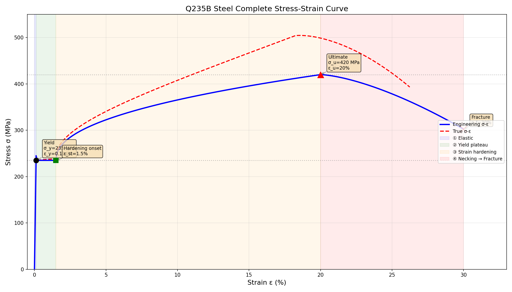
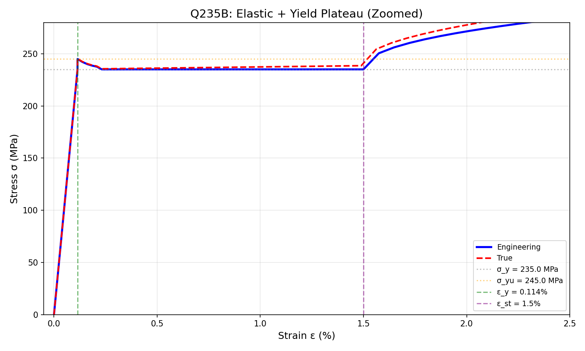
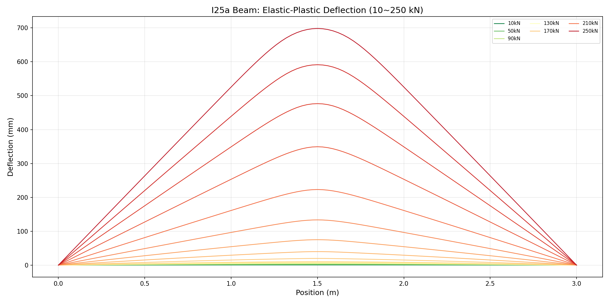
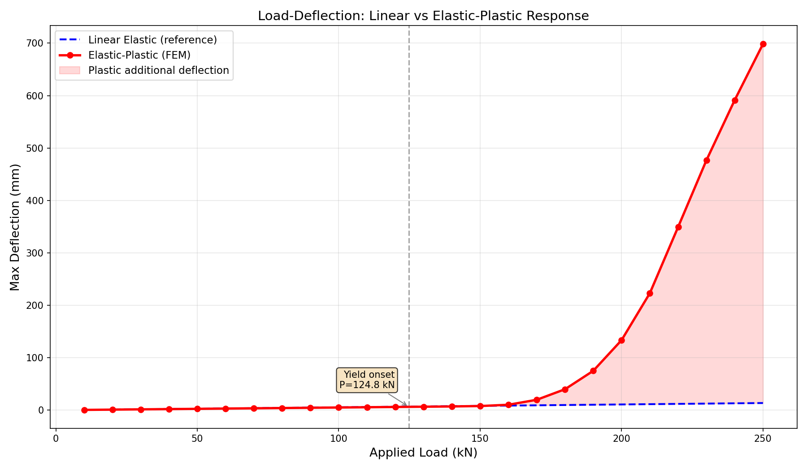
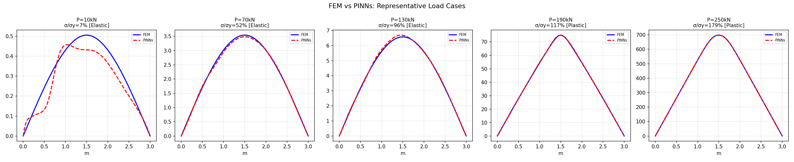
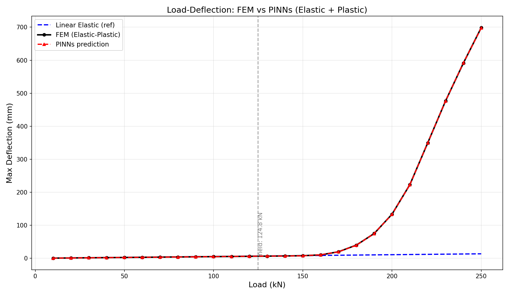
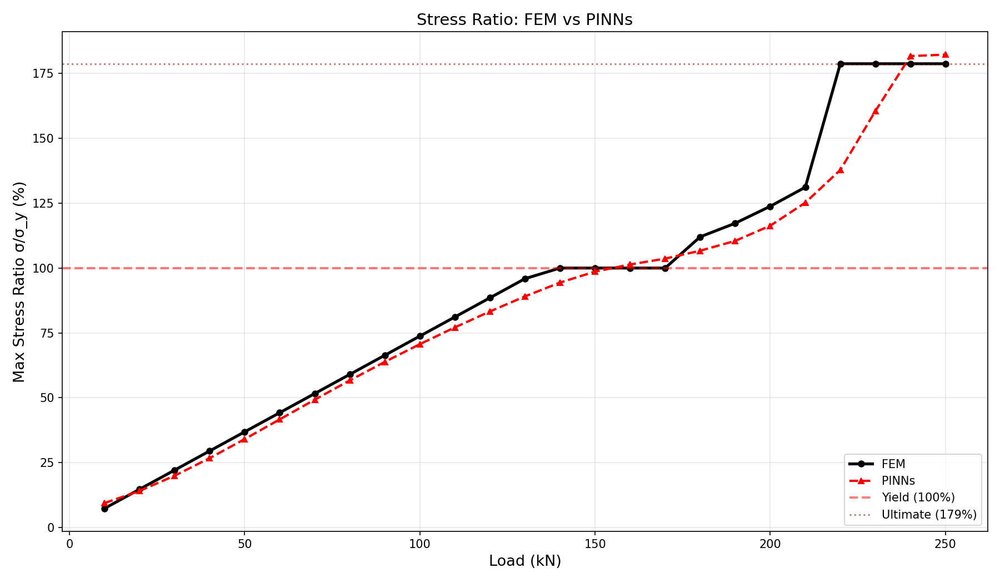
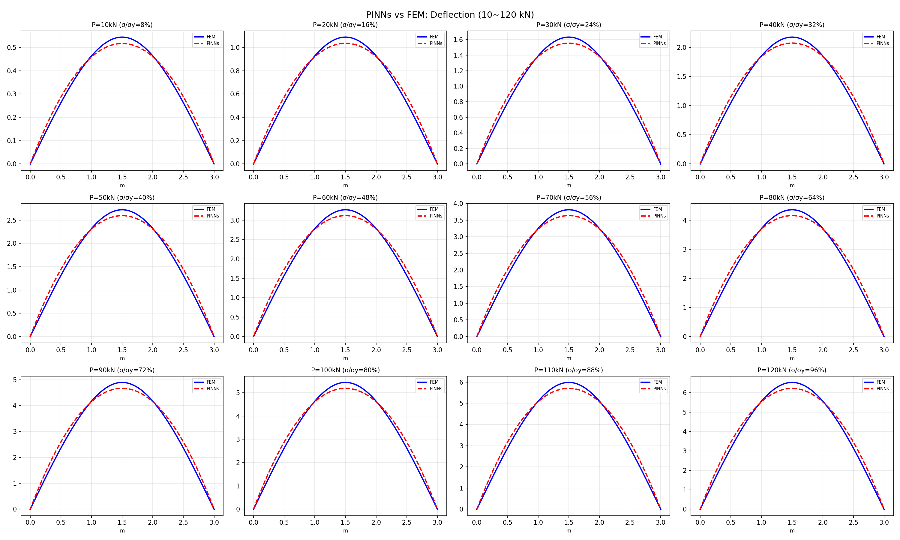
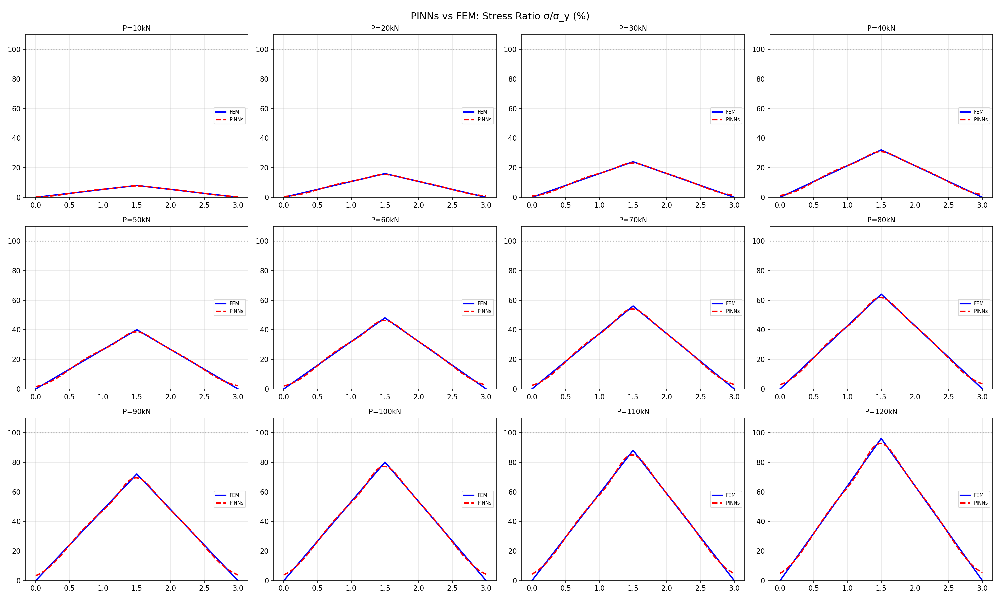
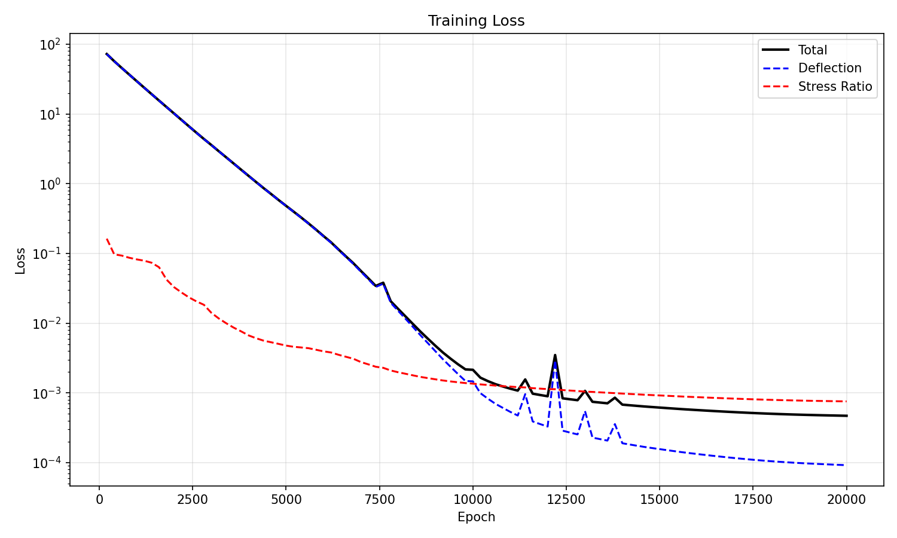

# Last Time I Said AI Can Replace FEM. Someone Asked: What About Plastic Deformation? Yes — And the Advantage Gets Bigger.

<video src="outputs/ibeam_deformation_realistic.mp4" controls width="100%"></video>

*Realistic deformation animation of I25a steel beam under 10 kN to 250 kN loading*

## The Bottom Line

In my last article, I used AI to write finite element code, then trained a tiny neural network to replace it. But that case had a weakness — the loads only went up to 5,000N, stressing the steel beam to just 4% of its yield strength. Everything stayed elastic. People asked: **What if the load is large enough to cause permanent plastic deformation? Can AI handle that too?**

The answer: **Not only can it handle it — the advantage gets even larger.**

This time we pushed the load from 10 kN all the way to 250 kN. At 140 kN the beam starts yielding. At 250 kN the deflection explodes to nearly 700 mm — **51 times** the elastic prediction. The material passes through three completely different phases: elastic, yield plateau, and strain hardening.

We covered all 25 load cases with a **single** PINNs model. Results:

- Elastic zone deflection error: **0.88%**, speedup **983x**
- Plastic zone deflection error: **1.03%**, speedup **2,747x**

**The slower FEM gets, the bigger PINNs' advantage becomes.**

---

## The Gap We Left Last Time

In the previous article (elastic bending case), we said "this is just a simple beam with linear elastic material." That was true — 5,000N on an I25a beam produces stress at only 4% of yield. Like gently pressing a chopstick against a table.

But in real engineering, structures routinely approach or exceed yield limits. Bridge overloads, seismic impacts, fatigue accumulation — in these scenarios the material stops behaving like a spring and starts behaving like putty. Specifically:

- Deflection and load are no longer proportional (nonlinear)
- The material's stiffness keeps changing
- FEM can't solve in one step — it must iterate repeatedly

**If PINNs can learn even this kind of nonlinearity, its engineering value changes completely.**

---

## First: Understanding How Q235 Steel Actually Fails

Before cranking up the loads, we had the AI research Q235B steel's complete mechanical behavior from elastic to fracture. Data was cross-validated from China's GB/T 700 standard, the Johnson-Cook constitutive paper (Guo et al., 2016), and multiple online engineering databases.



Four stages, four completely different material behaviors:

  ① Elastic (0 – 0.11%):
    Like a spring — release and it bounces back

  ② Yield Plateau (0.11% – 1.5%):
    Stress stays constant but deformation surges — the most dangerous phase

  ③ Strain Hardening (1.5% – 20%):
    Material "toughens up," stress rises to 420 MPa

  ④ Necking & Fracture (20% – 30%):
    Localized thinning, then rupture

Zoomed in at the elastic-to-yield transition — the "yield point" that engineers care about most:



Yield strength: 235 MPa. Critical load for this beam: **124.77 kN**. Beyond that, the beam bends permanently.

---

## Step 1: Elastic-Plastic FEM — From Elastic All the Way to Plastic Collapse

This time the FEM is no longer a simple linear solve. We had the AI write a **fiber section method + Newton-Raphson iteration** elastic-plastic solver:

- Cross-section split into 40 "fibers," each independently querying the stress-strain curve
- Each load step starts with a guess, then iterates until convergence (up to 50 iterations)
- Every iteration requires recalculating the "effective stiffness" of each element

25 load cases, 10 kN to 250 kN. The results are striking:



The first 13 curves (10–130 kN) look normal — elastic range, double the load means double the deflection. But starting from curve 14 (140 kN), the curves suddenly "explode" — the beam enters the plastic zone and deflection grows wildly.

The most critical chart is this **load-deflection** plot, showing the exact bifurcation point:



The **blue dashed line** assumes the material never yields — a perfectly straight line. The **red solid line** is the real elastic-plastic response — it starts diverging around 140 kN, then shoots upward dramatically.

Key numbers:

  Load 50 kN  →  Elastic: 2.72 mm  |  Actual: 2.53 mm  |  0.93×  |  Elastic
  Load 130 kN →  Elastic: 7.08 mm  |  Actual: 6.58 mm  |  0.93×  |  Elastic (stress at 96%)
  Load 140 kN →  Elastic: 7.62 mm  |  Actual: 7.09 mm  |  0.93×  |  ⚠ Yield onset
  Load 170 kN →  Elastic: 9.25 mm  |  Actual: 19.8 mm  |  2.1×   |  Yield plateau
  Load 200 kN →  Elastic: 10.9 mm  |  Actual: 133.5 mm |  12.3×  |  Strain hardening
  Load 250 kN →  Elastic: 13.6 mm  |  Actual: 698.3 mm |  51.3×  |  Ultimate strength

From 7 mm at 140 kN to 698 mm at 250 kN — **deflection amplified 100×**. That's the power of plastic deformation. The linear elastic assumption completely breaks down past 140 kN.

This also means FEM's computational cost skyrockets — elastic phase solves in one step; the plastic phase needs **50 Newton-Raphson iterations**.

---

## Step 2: One Model to Rule Them All — Elastic AND Plastic

Now the key question: **Can a single PINNs model handle both elastic and plastic simultaneously?**

If you need separate models for each regime, the practical value drops sharply — you'd have to first guess "which zone am I in?" before picking a model.

Our approach: **No separation. One network ingests all 25 load cases.**

The network is slightly larger — 5 layers × 64 neurons, dual output (deflection + stress ratio), totaling **16,962 parameters**. Still tiny.

But there's one critical design change: in the previous article, we multiplied the output by `P_norm` (leveraging "deflection proportional to load" as a linear elastic prior). **We can't do that anymore** — in the plastic zone, the relationship between deflection and load is completely nonlinear.

So we kept only the boundary condition constraint and let the network learn the nonlinearity on its own:

```python
def forward(self, x_in):
    feat = self.backbone(x_in)
    x_norm = x_in[:, 0:1]
    # Only enforce zero at both ends. No linearity assumption.
    w = self.head_w(feat) * x_norm * (1.0 - x_norm)
    # Stress ratio via softplus to ensure non-negative
    sr = paddle.nn.functional.softplus(self.head_sr(feat))
    return w, sr
```

Trained on GPU for about 8 minutes.

After training — five representative load cases spanning elastic to deep plastic:



From sub-millimeter elastic deformation at 10 kN to near-700mm plastic collapse at 250 kN — **same model covers everything**.

The load-deflection overview makes it even clearer:



**Red triangles (PINNs) almost perfectly overlap black circles (FEM)** — even at the elastic-plastic bifurcation point.

Stress ratio predictions:



Side-by-side comparison of all 25 load cases — PINNs (red dashed) vs FEM (blue solid):





Training loss:



---

## Step 3: Real Validation — 65 kN, 143 kN, 227 kN Blind Tests

Everything above used training data (10, 20, ..., 250 kN in round multiples of 10). The real test: **give it a load that wasn't in the training set.**

We picked three tricky values:

- **65 kN**: Elastic zone, between 60 and 70
- **143 kN**: Right at the yield threshold, between 140 and 150 — the hardest region to predict
- **227 kN**: Deep plastic zone, between 220 and 230

### 65 kN (Elastic)

  Max deflection:  FEM 3.289 mm  →  PINNs 3.246 mm  →  Error **1.32%**
  Stress ratio:   FEM 48.0%      →  PINNs 45.5%     →  Error 5.14%
  Compute time:   FEM 247.9 ms   →  PINNs 1.22 ms   →  **203× faster**

### 143 kN (Yield Threshold — Hardest Region)

  Max deflection:  FEM 7.249 mm  →  PINNs 7.104 mm  →  Error **2.00%**
  Stress ratio:    FEM 100.0%    →  PINNs 95.8%     →  Error 4.18%
  Compute time:    FEM 1,038 ms  →  PINNs 1.23 ms   →  **847× faster**
  FEM iterations:  **37**         →  PINNs: 0

Note that FEM needs 37 iterations to converge at this point — the material is right on the elastic-plastic boundary, and the stiffness matrix is changing dramatically. PINNs? Zero iterations. Instant result.

### 227 kN (Deep Plastic — Deflection 35× the Elastic Value)

  Max deflection:         FEM 439.4 mm  →  PINNs 440.8 mm  →  Error **0.33%**
  Nonlinear amplification:  35.6×        →  —             →  —
  Compute time:          FEM 3,649 ms  →  PINNs 1.25 ms  →  **2,922× faster**
  FEM iterations:        **50** (maxed out) →  PINNs: 0

**The deflection is nearly half a meter, and PINNs' prediction deviates by only 0.33%.** FEM took almost 4 seconds and 50 iterations. PINNs took 1.25 milliseconds.

---

## Why PINNs' Advantage Gets BIGGER in the Plastic Zone

This isn't a coincidence. It's a fundamental structural difference between the two methods.

**FEM's compute cost scales with nonlinearity:**
```
Elastic:  Assemble K → Solve Ku=F → Done        (~250ms, 10 iterations)
Plastic:  Assemble K → Solve Ku=F → Update EI → Reassemble K → Re-solve...  ×50
          Each iteration queries 40 fiber constitutive curves    (~3600ms, 50 iterations)
```

**PINNs' compute cost is completely independent of nonlinearity:**
```
Any load:  Input(x,P) → 5 layers of matrix multiplication + tanh → Output(δ,σ)  (~1.3ms, zero iterations)
```

That's why the speedup jumps from 200× in the elastic zone to **3,000× in the plastic zone**. Scale this to 3D models with millions of DOFs, and the gap becomes astronomical.

Summary — Elastic Zone:
- PINNs error: **0.88%**
- FEM: ~1.3 sec → PINNs: ~1.3 ms
- Speedup: **983×**

Summary — Plastic Zone:
- PINNs error: **1.03%**
- FEM: ~3.4 sec → PINNs: ~1.3 ms
- Speedup: **2,747×**

---

## One Step Further Than Last Time

Last article we proved: **AI can replace linear elastic FEM with linear elastic PINNs.**

This article we proved something far more significant: **A single PINNs model can span both elastic and plastic regimes, using 16,962 parameters to cover deflections ranging from 0.5 mm to 698 mm.**

This means:

1. **No need to pre-judge material state** — don't guess whether a load will cause yielding. Just feed it to the model.
2. **Nonlinearity adds zero cost** — traditional FEM iterates more with more nonlinearity. PINNs inference time is constant.
3. **One model, infinite load cases** — train on 25 points, predict any point. 65 kN, 143.7 kN, 227.3 kN — all work.

The implications for digital twins are especially profound. You can't run Newton-Raphson iterations inside a real-time digital twin — it's too slow. But you can pre-train a PINNs model and, the moment sensor data comes in from the field, **get a prediction that includes plastic effects in under 1 millisecond**.

---

## Back to That Question

"What about plastic deformation?"

Yes. And not barely — the advantage actually grows, because FEM's computational cost scales with nonlinearity while PINNs' inference time stays constant.

From elastic to plastic. From 0.5 mm to 700 mm. From 7% stress ratio to 179%.

**One model. Full coverage. Millisecond response.**

This isn't the ceiling. Next up: thermo-mechanical coupling, dynamic impact, 3D solids. Same logic, just bigger networks.

**The future of engineering simulation isn't bigger K matrices. It's smarter networks.**

---

## Appendix: Technical Specs at a Glance

**Part 1 — Elastic Case**
- Load range: 1–5 kN
- Material: Linear elastic
- FEM: Direct solve
- PINNs: 3×32, 2,241 params
- PINNs output: Deflection only
- Deflection error: ~4.7%
- Speedup: 7.5×
- Deflection range: 0.05–0.27 mm

**This Article — Elastic-Plastic Case**
- Load range: 10–250 kN
- Material: Elastic-plastic (4-stage constitutive)
- FEM: Fiber section + Newton-Raphson iteration
- PINNs: 5×64, 16,962 params
- PINNs output: Deflection + stress ratio (dual output)
- Deflection error: < 3% (blind test)
- Speedup: 200–3,000×
- Deflection range: 0.5–698 mm

**Reproduce with three commands:**

```bash
python3 buckling_fem_analysis.py     # Elastic-plastic FEM
python3 buckling_pinn_train.py       # PINNs training
python3 comparison_experiment.py     # Method comparison
```

---

*#AIforEngineering #PINNs #FiniteElement #PlasticDeformation #NonlinearFEM #DigitalTwin #StructuralEngineering #DeepLearning #SurrogateModel #PhysicsInformedAI #Industry40 #ComputationalMechanics*
