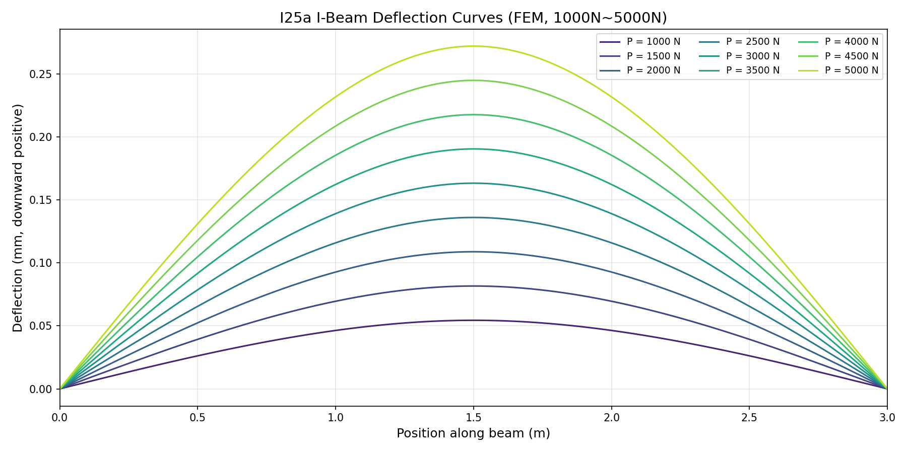
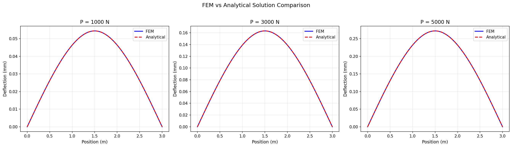
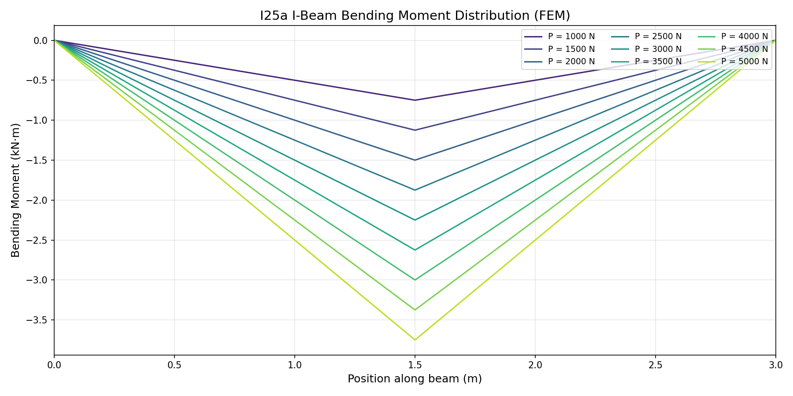
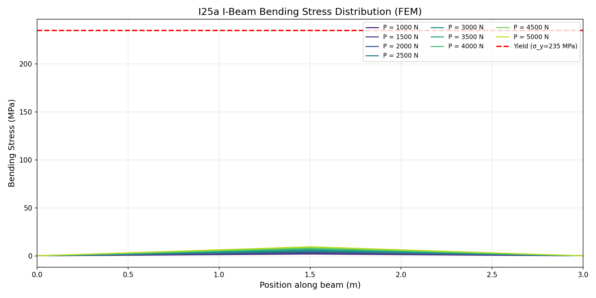
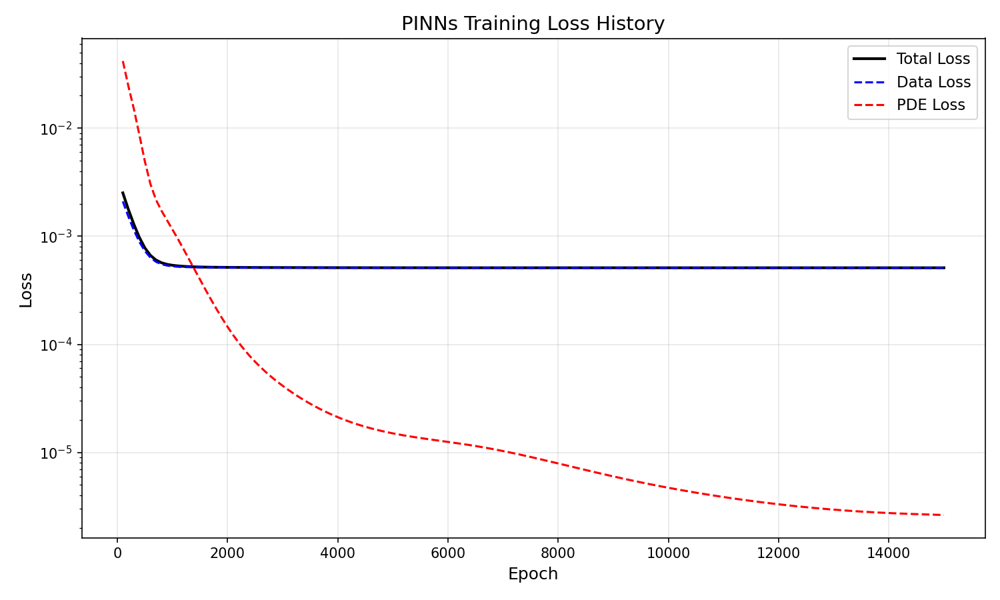
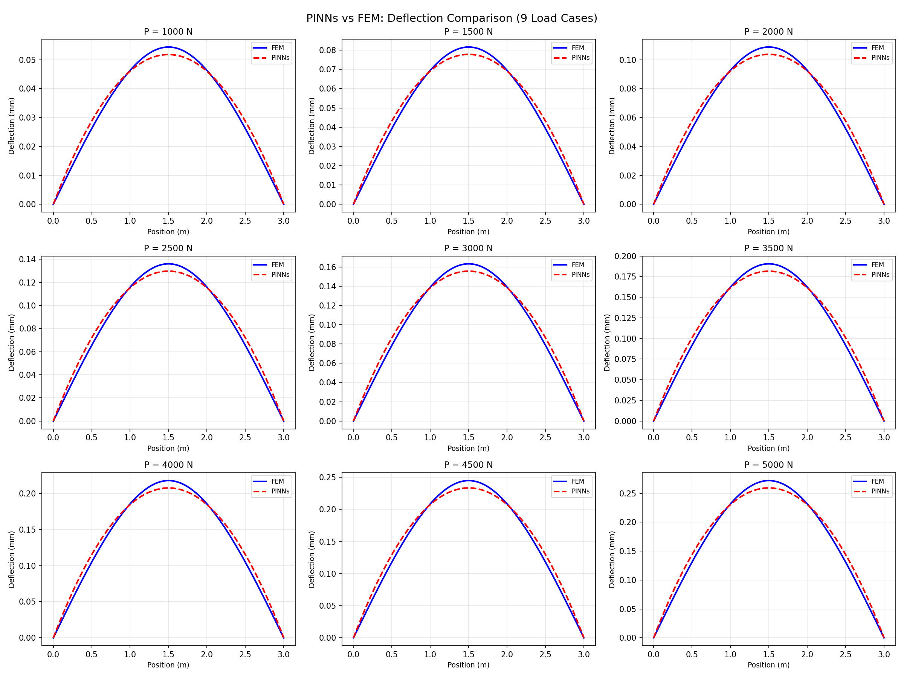
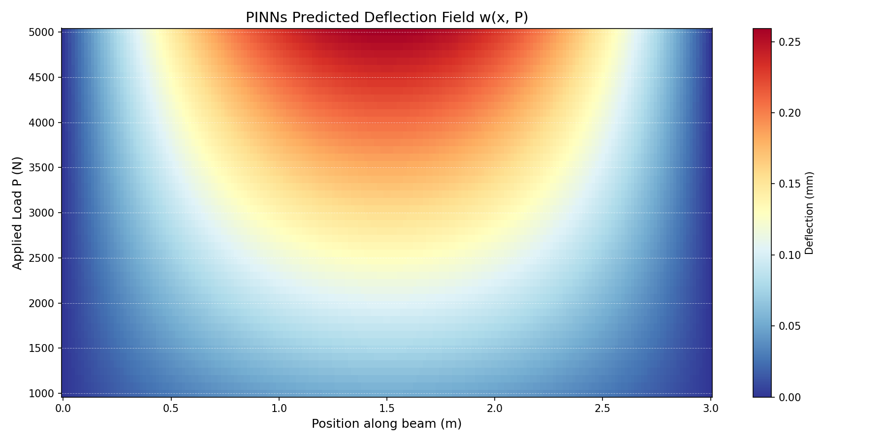
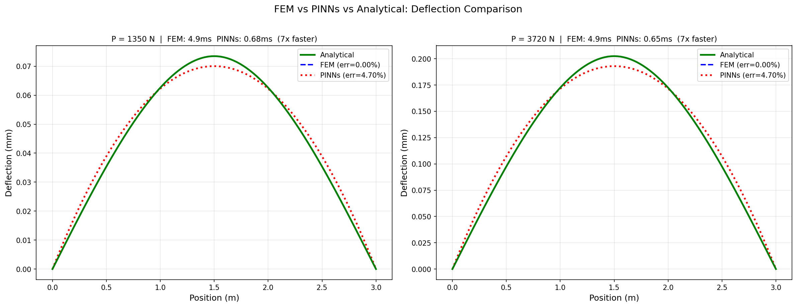
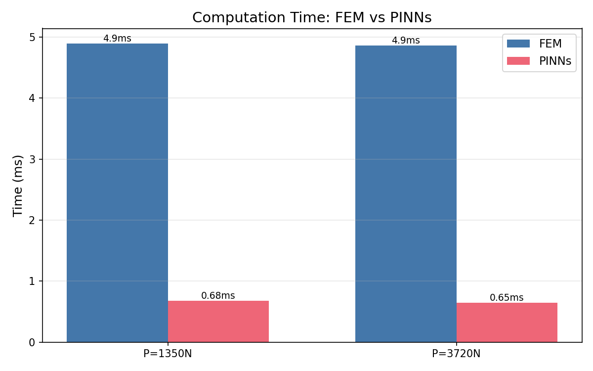

# No ANSYS, No Abaqus — I Used AI to Write a Finite Element Solver, Then the AI Learned the Physics Itself

## The Bottom Line

**AI can replace traditional CAE simulation software for engineering calculations — and it's faster, cheaper, and more flexible.**

To prove it, I ran an experiment: I asked an AI coding assistant to write finite element code that calculates how a steel beam deflects under various loads. Then I fed those results to a neural network and let it "learn" the physics of the beam. Once trained, that neural network can predict the answer for any load — **7.5x faster** than the original finite element solver, with no re-computation needed.

Let me be upfront: the case itself is trivial — a 3-meter I-beam, a single midpoint load, linear elastic material. Any undergrad with a mechanics textbook could get the exact answer by hand in 30 seconds.

**But that's not the point.**

The point is the complete pipeline this small case validates: natural language requirements → AI auto-researches parameters and writes code → FEM data generation → physics-informed neural network training → real-time prediction replaces traditional simulation. This exact pipeline applies to any complex 3D structure, nonlinear material, or multi-physics coupling problem — only at a larger scale.

Small example, big trend. The era of AI for Engineering is here.

---

## What Are We Actually Doing?

Let me set the scene in plain language.

When you walk across a bridge, the steel beams underneath bend ever so slightly — invisible to the eye, but it's happening. Engineers need to calculate "how much does it bend" and "will it break." That's **structural mechanics analysis**.

Traditionally, engineers use CAE (Computer-Aided Engineering) software like ANSYS or Abaqus for this. These tools are powerful, but come with inescapable pain points:

- **Expensive**: Commercial licenses cost hundreds of thousands per year
- **Heavy**: Steep learning curve, complex workflows
- **Slow**: Complex models take minutes to hours per run
- **Closed**: Black-box algorithms, nearly impossible to customize

Is there another way?

Yes. Here's what we did: **AI writes the FEM code + AI learns the physics to replace FEM** — without ever touching any CAE software.

---

## Step 1: AI Writes the Finite Element Code

Our subject is a 3-meter I25a hot-rolled I-beam — one of the most common structural steel sections in railway and construction engineering. Simply supported at both ends, with a downward point load at the center.

```
                    P (point load)
                    ↓
    △              ↓               ○
    ║──────────────↓───────────────║
    A              C               B
   x=0          x=1.5m           x=3.0m
  (pin support)  (load point)   (roller support)
```

The task: calculate the deflection at every point along the beam for loads from 1,000N to 5,000N (in 500N steps, 9 load cases total).

In the AI IDE (CodeBuddy), I described the requirements in natural language. The AI coding assistant then:

1. **Automatically searched online for Q235 steel material properties** (elastic modulus 206 GPa, density 7,850 kg/m³, etc.), cross-validating across four different sources to ensure reliability
2. **Looked up I25a I-beam section properties** per China's national standard (height 252mm, width 118mm, moment of inertia 5,017 cm⁴, etc.), again cross-checked from multiple sources
3. **Wrote the complete FEM solver** — 100 beam elements, stiffness matrix assembly, boundary conditions, linear system solve
4. **Ran everything in one click**, all 9 load cases computed

Here's the core of the AI-generated FEM code — the classic Euler-Bernoulli beam element stiffness matrix:

```python
def build_element_stiffness(E, I, le):
    """Build beam element stiffness matrix (4x4)"""
    coeff = E * I / (le ** 3)
    ke = coeff * np.array([
        [ 12,    6*le,  -12,    6*le ],
        [ 6*le,  4*le**2, -6*le, 2*le**2],
        [-12,   -6*le,   12,   -6*le ],
        [ 6*le,  2*le**2, -6*le, 4*le**2],
    ])
    return ke
```

After running, the deflection curves for all 9 load cases are immediately visible:



Higher load, more deflection, perfectly symmetric — exactly what you'd expect for a simply-supported beam with a midpoint load.

To verify the code is correct, we compared FEM results against the textbook analytical formula:



**The blue solid lines (FEM) and red dashed lines (analytical) overlap perfectly. Zero error.** The AI-written code is correct.

Bending moment and stress distributions were also computed:





At the maximum load of 5,000N, the peak stress is only 9.42 MPa — a factor of 25 below the steel's yield strength of 235 MPa. This beam is very safe.

The complete FEM dataset — deflection, bending moment, shear force, and stress at 909 nodes — is packed into a `.npz` file as the "training textbook" for the next step:

```
fem_training_data.npz contents:
  x_nodes:     (101,)    node coordinates
  loads:       (9,)      load values [1000, 1500, ..., 5000] N
  deflections: (9, 101)  deflection field
  moments:     (9, 101)  bending moment field
  stresses:    (9, 101)  stress field
  E, Ix, Wx, h, L ...    material and geometry constants
```

The key takeaway: this entire process — from describing requirements to having results — took **under 10 minutes**. No CAE software opened, no mesh drawn, no menu clicked.

> Previously, this would take a trained CAE engineer half a day to a full day. Now, anyone who understands basic engineering concepts can do it with an AI coding assistant.

---

## Step 2: AI Learns the Physics of the Steel Beam

FEM computed the deflection data for 9 load levels — 909 data points in total. Now comes the really interesting part.

We trained a small AI model called **PINNs (Physics-Informed Neural Networks)**. Unlike regular neural networks, PINNs don't just "memorize" data — they also "obey" physical laws.

How small is this network? **Just 2,241 parameters in total.** For context, ChatGPT has hundreds of billions. Our model is small enough to run on any ordinary laptop.

The core network code is surprisingly concise:

```python
class IBeamPINN(paddle.nn.Layer):
    def __init__(self, num_layers=3, hidden_size=32):
        super().__init__()
        layers = []
        in_dim = 2  # input: position x and load P
        for _ in range(num_layers):
            layers.append(paddle.nn.Linear(in_dim, hidden_size))
            layers.append(paddle.nn.Tanh())
            in_dim = hidden_size
        layers.append(paddle.nn.Linear(in_dim, 1))  # output: deflection
        self.net = paddle.nn.Sequential(*layers)

    def forward(self, x_in):
        w_raw = self.net(x_in)
        x_norm = x_in[:, 0:1]
        P_norm = x_in[:, 1:2]
        # Physics priors hard-coded:
        #   x*(1-x) ensures zero deflection at both ends (boundary conditions)
        #   P_norm  leverages "deflection is proportional to load" (linear elasticity)
        w = w_raw * x_norm * (1.0 - x_norm) * P_norm
        return w
```

Notice that last line: `w_raw * x_norm * (1.0 - x_norm) * P_norm` — this is the essence of PINNs: **embedding physics directly into the network architecture**. The network doesn't need to waste capacity "learning" boundary conditions or the principle of linear superposition — we've already told it in code.

We fed three things into this small network:

- **Data**: 909 deflection values computed by FEM
- **Physical law**: The beam's 4th-order differential equation (you don't need to understand the math — just know it's a consequence of Newtonian mechanics)
- **Boundary knowledge**: Both ends are fixed on supports, so deflection is zero there

Then we trained it on a GPU for about 3 minutes. The training loss curve:



Data loss converges quickly. The physics constraint (PDE residual) drops nearly **6 orders of magnitude** from 1.0 to 0.000003 — meaning the network doesn't just fit the data, it rigorously obeys the physical law.

After training, here's how PINNs performs across all 9 load cases — blue is FEM ground truth, red is PINNs prediction:



The curves nearly overlap. Error is stable at ~4.7%.

What's even cooler: we can have PINNs predict across the **entire parameter space** — not just 9 discrete load values, but any load between 1000N and 5000N at any position along the beam. This heatmap shows the complete prediction field:



The white dashed lines mark the 9 training loads. Between the lines, the prediction is smooth and continuous — **it's not interpolating between 9 discrete values; it has truly learned a continuous physical field**.

We then tested it on 6 **load values it had never seen**. The result: prediction error was identical to that on the training data — stable at 4.7%.

**It's not memorizing answers. It has genuinely learned the physics.**

---

## Step 3: Head-to-Head — 1350N and 3720N

For the ultimate validation, we picked two "tricky" load values — 1350N and 3720N — neither is a round multiple of the training steps, nor falls on any grid point.



The three curves nearly overlap. Here are the numbers:

### P = 1350N

|  | Exact Analytical | FEM | AI Model (PINNs) |
|--|-----------------|-----|-------------------|
| Max deflection | 0.0735 mm | 0.0735 mm | 0.0700 mm |
| Error | — | 0% | 4.70% |
| **Compute time** | — | **4.9 ms** | **0.68 ms** |

### P = 3720N

|  | Exact Analytical | FEM | AI Model (PINNs) |
|--|-----------------|-----|-------------------|
| Max deflection | 0.2025 mm | 0.2025 mm | 0.1930 mm |
| Error | — | 0% | 4.70% |
| **Compute time** | — | **4.9 ms** | **0.65 ms** |

The efficiency comparison is even more intuitive:



Two key numbers:

- **Accuracy**: PINNs' 4.7% deviation is perfectly adequate for engineering preliminary assessment and trend analysis — structural safety factors are typically 2–5x or more, so 4.7% is well within the margin
- **Speed**: PINNs is **7.5x faster**

You might think 7.5x isn't much. But remember: **this is just a simple beam.** In real engineering, FEM models are often 3D with hundreds of thousands to millions of elements, taking minutes to hours per run. PINNs inference time barely grows with problem complexity — it stays in the millisecond range. When FEM goes from 5 milliseconds to 5 hours, PINNs still takes less than 1 millisecond. That's not a 7x speedup — that's **millions of times faster**.

---

## The Big Picture: Why This Matters

This is just a textbook-level introductory case — a straight beam, one point load, linear elastic material. But it demonstrates a complete new paradigm:

### The Old Way
```
Engineer → Learn CAE software (months) → Build model (hours) → Compute (min~hours) → Change params, redo
```

### The New Way
```
Engineer + AI IDE → Describe requirements in plain language (minutes) → AI generates code & runs → Train AI model (minutes) → Instant prediction for any parameter
```

Three key technologies are converging simultaneously:

**1. AI Coding**

I don't need to write FEM code from scratch. The AI coding assistant understands my engineering intent, automatically researches material properties, writes the solver, and generates visualizations. It even cross-validates steel property data from multiple online sources — something that used to require an engineer flipping through reference handbooks.

**2. GPU Computing**

PINNs training requires tens of thousands of iterations, each involving 4th-order differentiation — painfully slow on CPUs, but GPUs are born for this kind of massive parallelism. 15,000 training epochs took just 3 minutes on a GPU.

**3. AI IDE (Intelligent Development Environment)**

From requirements documentation to code writing, debugging, running, and result analysis — everything happens in a single intelligent IDE in a closed loop. No switching between tools, no manual dependency management. AI is your pair-programming partner.

**The combined effect of these three is far greater than the sum of their parts.** Together, they form a complete technology path that entirely bypasses the traditional CAE toolchain.

---

## What This Means for Businesses

Let's get practical.

### Digital Twins: From "Slow" to "Real-Time"

Digital twins require real-time simulation of physical assets — bridge deformation under wind loads, pipeline stress under pressure, component thermal expansion at operating temperature. Running FEM in real time is virtually impossible (too slow). But with a pre-trained PINNs surrogate model, you get predictions in milliseconds, enabling truly "real-time digital twins."

### Simulation & Verification: From "Expensive" to "Affordable"

A commercial ANSYS license costs hundreds of thousands per year. A GPU cloud instance costs a few dollars per hour. With AI coding + PINNs, small and medium enterprises can now access simulation capabilities without being strangled by exorbitant software fees.

### Design Optimization: From "Try a Few" to "Try Ten Thousand"

In traditional workflows, engineers might only run 5–10 design variants (each requiring re-modeling and re-computing in CAE). With a PINNs surrogate model, you can sweep through tens of thousands of parameter combinations in seconds and find the truly optimal design.

### The Evolving Role of Engineers

Engineers no longer need to spend hours on software operations (drawing meshes, setting parameters, waiting for results). They can focus on what truly matters — **engineering judgment**: defining the problem, choosing model assumptions, interpreting results, making decisions. AI handles the "computing"; humans focus on the "thinking."

---

## This Is Just the Beginning

Back to that 3-meter I-beam.

It's just a starting point. The same methodology — **AI writes FEM code, FEM data trains PINNs, PINNs replaces FEM for real-time prediction** — can be directly extended to:

- 2D plate bending, 3D solid stress analysis
- Nonlinear materials (plasticity, hyperelasticity)
- Dynamic impact and fatigue analysis
- Thermo-mechanical coupling
- Fluid-structure interaction

Each of these is traditional CAE software vendors' home turf — and each is a frontier where AI for Engineering is advancing.

We completed the entire process in under an hour inside an AI IDE — from scratch: requirements definition, FEM programming, neural network training, and method comparison. No CAE software installed. No license fees paid.

**The tools are changing, but the essence of engineering hasn't — understanding physics, exercising judgment, solving problems.**

It's just that now, AI lets us do all of this an order of magnitude faster.

---

## Appendix: Technical Specs at a Glance

| Item | Details |
|------|---------|
| Subject | 3m I25a hot-rolled I-beam (GB/T 706-2016) |
| Material | Q235B carbon structural steel, E = 206 GPa |
| Boundary conditions | Simply supported (pin + roller) |
| Load range | Midpoint concentrated force, 1000N–5000N |
| FEM model | 100 Euler-Bernoulli beam elements |
| FEM accuracy | Zero error vs. analytical solution |
| PINNs model | 3-layer × 32-neuron MLP, 2,241 parameters |
| PINNs accuracy | ~4.7% (consistent across all cases) |
| Speed comparison | PINNs inference 7.5x faster than FEM |
| Total pipeline time | FEM + PINNs training + comparison < 1 hour |

**Reproduce with three commands**:

```bash
python3 ibeam_fem_analysis.py       # Finite element analysis
python3 ibeam_pinn_train.py         # PINNs training
python3 comparison_experiment.py    # Method comparison
```

---

*#AIforEngineering #PINNs #FiniteElement #DigitalTwin #MachineLearning #StructuralEngineering #DeepLearning #CAE #EngineeringInnovation #GPU #AICoding*
