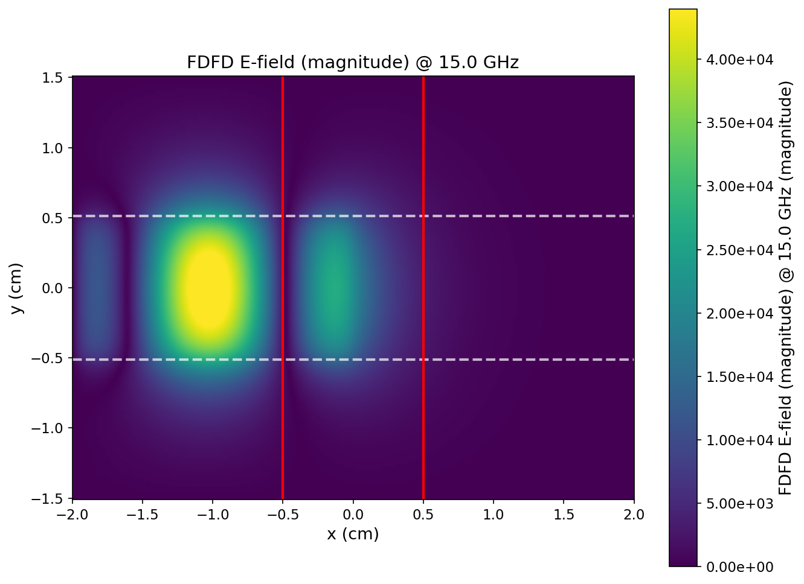
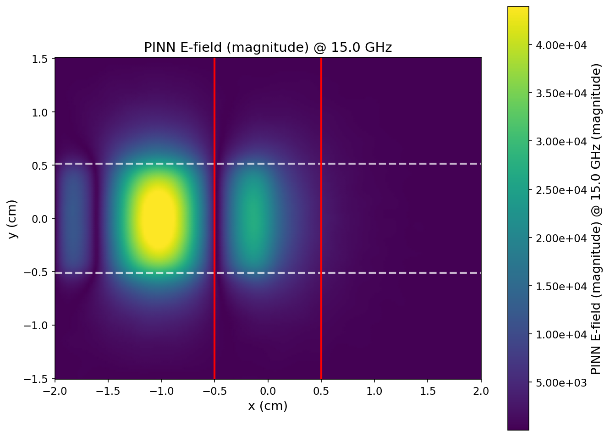
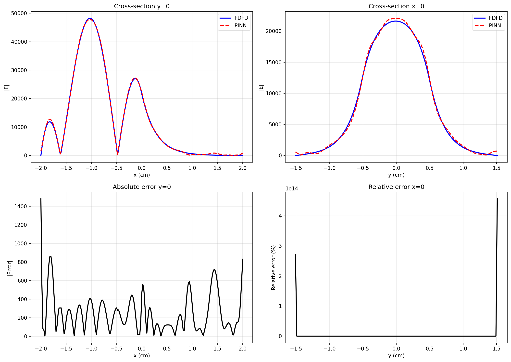
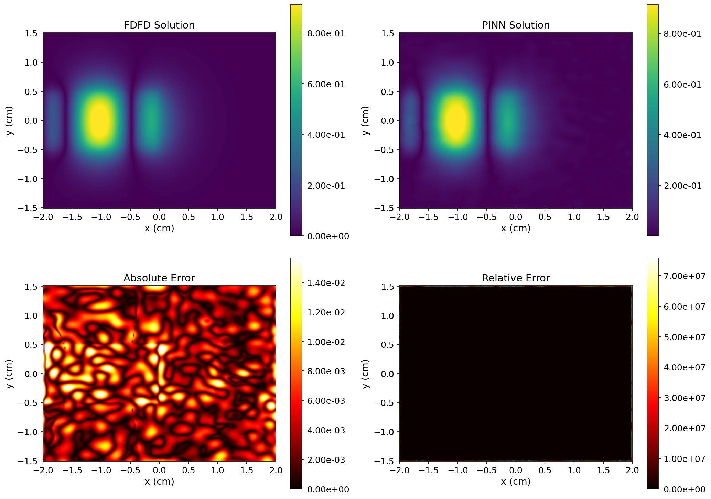

# I Built a Physics Solver in Hours Using AI. Here's Why the $11B CAE Industry Should Pay Attention.

Everyone in CAE simulation knows the drill: import geometry, mesh it, set boundary conditions, hit "Solve," and wait. Minutes if you're lucky. Hours if you're not. Overnight for anything serious.

I've spent years in industrial software — FEM, CFD, computational electromagnetics. Recently, I decided to stop reading about AI for Engineering and actually test it. I built a complete electromagnetic simulation pipeline from scratch — geometry modeling, FDFD solver, PINN training, post-processing, benchmarking — using an AI coding assistant and a single GPU.

**It took one person a few hours. The same scope would traditionally require a small team working for weeks.**

Here's what I found, and why I think it matters for anyone in simulation, manufacturing, or engineering software.

---

## The Experiment: 2 Minutes to Train a Solver

The problem: compute the electric field distribution of a Ku-band rectangular waveguide slot antenna at 15 GHz. Standard Helmholtz equation with PML boundaries — bread and butter for any EM simulation tool.

I first solved it with a conventional Finite-Difference Frequency-Domain (FDFD) method as the ground truth. Then I trained a Physics-Informed Neural Network (PINN) — a small 4-layer MLP with 64 neurons per layer — to learn the same solution. Training ran on a single Tesla T4 GPU, 1,000 epochs, about two minutes.

The results:

*Fig. 1: Conventional FDFD solution*

*Fig. 2: PINN prediction — visually indistinguishable from Fig. 1*

Point-by-point comparison across 30,552 grid points:

| Metric | Value |
|--------|-------|
| L2 relative error | 2.49% |
| Pearson correlation | 0.9996 |

| Operation | Traditional FDFD | PINN | Speedup |
|-----------|-----------------|------|---------|
| Single solve | 1.0 s | 0.022 s | 45× |
| 100-parameter sweep | ~100 s | 2.2 s | 45× |
| Training (one-time) | — | ~130 s | — |

*Fig. 3: Cross-section comparison — blue (FDFD) and red (PINN) nearly overlap*

*Fig. 4: Normalized full-domain comparison. Relative error in the 0.1% range.*

The key insight: traditional solvers recompute from scratch every time you change a parameter. A trained PINN answers any query in 0.022 seconds. Two minutes of training is a one-time cost; after that, every inference is milliseconds.

## It's Not Just Electromagnetics

PINNs don't care about your domain — they care about your equations. Structural mechanics (stress analysis, crash simulation, additive manufacturing), CFD (external aerodynamics, internal flow, HVAC), multi-physics coupling (thermal-structural, fluid-structure) — all have been successfully demonstrated in the literature.

| Domain | Governing Equations | Traditional Methods |
|--------|-------------------|-------------------|
| Electromagnetics | Maxwell / Helmholtz | FDFD, FDTD, FEM |
| Structural | Elasticity equations | FEM |
| Fluid dynamics | Navier-Stokes | FVM, FEM, LBM |
| Heat transfer | Conduction / convection | FDM, FEM |
| Acoustics | Wave equation | BEM, FEM |

At the end of the day, they're all PDEs plus boundary conditions. Switching domains just means switching equations.

CFD is particularly interesting — it's the most compute-hungry corner of CAE. A single automotive external aero simulation routinely takes overnight. If inference drops to seconds, the impact on design iteration speed for automotive, aerospace, and energy industries is transformative.

Multi-physics coupling may be even more compelling: a single PINN can simultaneously output temperature, displacement, and stress fields, with coupling relationships built directly into the training objective. No more iterating between two solvers and shuttling data back and forth.

## Digital Twins: From "Too Slow" to 45 FPS

The digital twin concept has been around for years, but real-time deployment remains rare. The bottleneck has always been the same: simulation is too slow to keep up with reality.

At 0.022 seconds per inference — 45 frames per second — you can drag a slider and watch the simulation update in real time. Not a pre-recorded animation. Actual computation, live.

Think about what this enables: adjusting a spoiler angle in a wind tunnel and seeing drag coefficients update instantly. Feeding real-time sensor data from a factory floor into a PINN and getting thermal stress predictions on the fly. Steering an antenna beam and watching the radiation pattern follow.

The hardware is ready. The frameworks exist. The missing piece is engineers who understand both the physics and the AI — and are willing to build the bridge.

## AI Coding Changes the Game

Here's what surprised me most about this project: the simulation code itself was easier to build than I expected.

The entire toolchain — geometry modeling, FDFD solver, PINN training pipeline, visualization, comparison module — was built with an AI coding assistant. I described what I wanted; it generated the code; I reviewed and adjusted. A few hours, start to finish.

The real moat of companies like ANSYS and COMSOL was never the algorithms — those are in textbooks. It was engineering implementation: turning theory into stable, efficient, production-quality code. That used to require years of accumulated effort and large teams.

AI coding tools are changing this equation fundamentally. A physicist or engineer who understands the problem can now build a working solver in a fraction of the time. The barrier to entry for custom simulation tools has dropped by an order of magnitude.

## The Competitive Landscape

This opportunity hasn't gone unnoticed:

- **NVIDIA** released PhysicsNeMo (formerly Modulus), an open-source physics-AI framework tightly coupled with their GPU ecosystem.
- **Major cloud providers** are offering HPC instances and hosting traditional CAE software in the cloud.
- **Startups** in AI for Science are emerging across the US, Europe, and China.

But here's what's interesting: **no one has yet productized the full pipeline — from AI-assisted solver development, to cloud-based PINN training, to real-time inference API delivery.** The frameworks exist in pieces. The end-to-end product does not.

That's the gap. And it's a big one.

## What Needs to Happen Next

The technology is ready. What's missing is the integration layer — turning proven techniques into products that working engineers can actually use. Specifically:

- **Domain-specific pre-trained models** for common PDE types (structural, thermal, EM), so engineers don't start from zero
- **Cloud-native training + inference platforms** where users upload CAD geometry, define physics, and get back a real-time simulation API
- **Validation frameworks** that let regulated industries (aerospace, automotive, energy) trust AI-generated results
- **Integration with existing CAD/PLM toolchains** — because no one is going to rip out their entire workflow

| Phase | Timeline | Goal |
|-------|----------|------|
| Exploration | 0–3 months | Small team validates 2–3 industry-specific scenarios, benchmarks against traditional methods |
| MVP | 3–6 months | Internal cloud platform prototype with training pipeline |
| Pilot | 6–12 months | Joint trials with 1–2 manufacturing / energy customers |
| Scale | 12+ months | Commercial product for automotive, aerospace, energy, electronics |

## Honest Limitations

PINN is not a silver bullet. In this project alone, I hit a major pitfall: without proper non-dimensionalization, the large coefficients in the Helmholtz equation caused training to diverge completely. Training data currently still requires a traditional solver to generate the initial reference. Changing to an entirely new geometry requires retraining.

These are real constraints. But the trajectory is clear: physics-informed, data-driven hybrid approaches will increasingly complement — and in many cases replace — traditional mesh-based solvers.

## Let's Talk

If you've read this far, you're probably one of two types of people:

**You're an engineer or engineering manager** at an automotive, aerospace, energy, or manufacturing company, and you're wondering whether AI simulation could accelerate your design cycles or reduce your CAE software costs. I'd be happy to discuss your specific use case — whether it's a feasibility assessment, a proof-of-concept, or a pilot project.

**You're working in AI, cloud computing, or scientific computing**, and you see the same convergence I do. I'm actively looking to collaborate with people who want to build at this intersection — whether that's co-developing domain-specific models, building cloud-native simulation platforms, or exploring new applications.

Either way, I'd love to hear from you. Drop me a message here on LinkedIn, or reach out directly. This space is moving fast, and the best work will come from people who combine deep physics knowledge with modern AI engineering.

---

*The code and experimental data behind this article are fully reproducible, built on open-source frameworks. If you're interested in the technical details, a collaboration, or exploring what AI simulation could do for your organization — let's connect.*

#AIforEngineering #CAE #PINN #DigitalTwin #Simulation #ComputationalEngineering #AISimulation #Physics #FEM #CFD #ManufacturingInnovation #IndustrialSoftware
